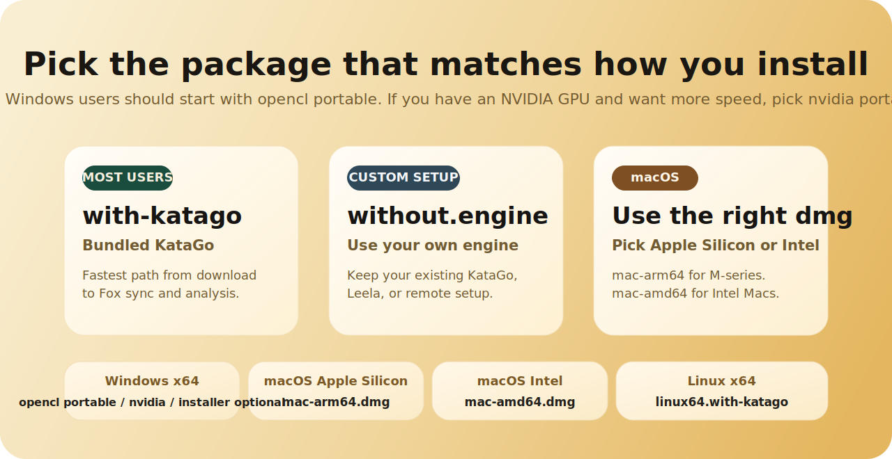
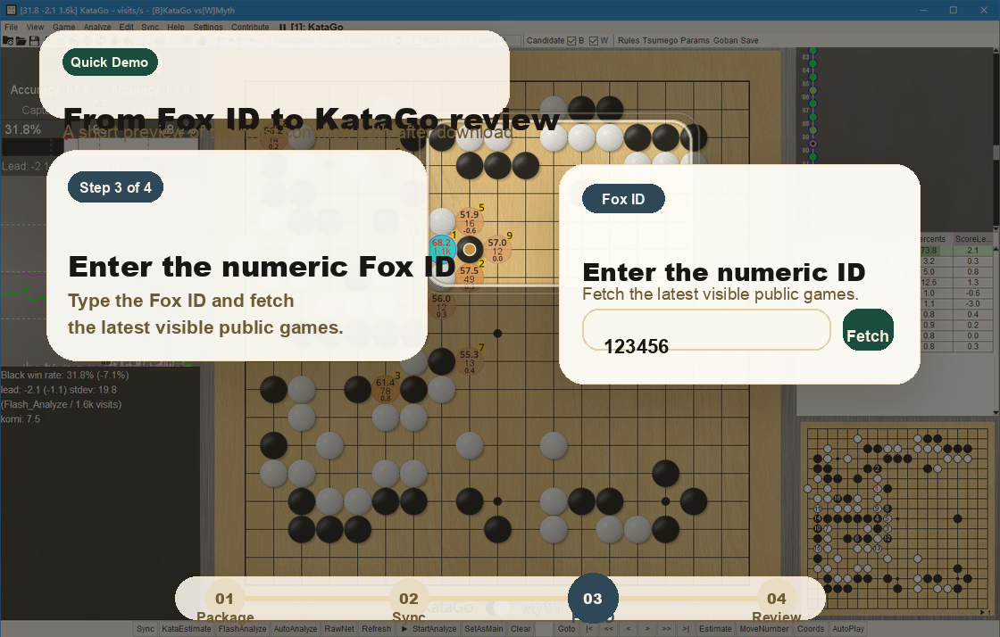
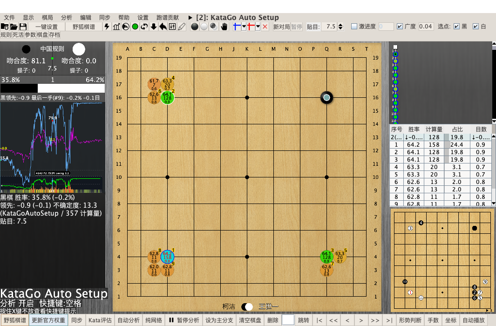

  

  
  
  
  

  <a href="README.md">中文</a> · <a href="README_EN.md">English</a> · 日本語 · <a href="README_KO.md">한국어</a>

  <strong>まだ lizzieyzy を使いたい人のために、きちんと続けて使える保守版です。</strong> 
  元のプロジェクトが長く保守されなかった結果、野狐棋譜取得で困る利用者が増えていました。この版では、まずその実用部分を直し、初回起動や KataGo 同梱もわかりやすく整えています。 
  <strong>これは普通の利用者向けの KataGo 復盤 GUI でもあり、現在も保守されている lizzieyzy の代替版です。</strong> 
  <strong>ダウンロードして、野狐のニックネームを入力し、棋譜取得と解析を続けられます。さらに、見やすくなった勝率グラフ、底部のクイック概要、全局を素早く走らせる解析によって、問題手を探しやすくなりました。</strong>

  <a href="https://github.com/wimi321/lizzieyzy-next/releases"><strong>Releases</strong></a>
  ·
  <a href="docs/INSTALL_JA.md"><strong>インストールガイド</strong></a>
  ·
  <a href="docs/TROUBLESHOOTING_EN.md"><strong>トラブル対応</strong></a>

> [!IMPORTANT]
> まずはこの 6 点だけ見れば大丈夫です:
> - Windows 利用者の多くは `windows64.opencl.portable.zip` を選べば始めやすいです。これは推奨の **OpenCL 版、インストール不要** です
> - OpenCL の相性が悪い場合は `windows64.with-katago.portable.zip` を代わりに使えます
> - NVIDIA GPU を使っていて、より速い解析を求めるなら `windows64.nvidia.portable.zip` を選べます
> - 野狐棋譜取得では **野狐のニックネーム** を入力します。アプリが対応するアカウントを自動で見つけます
> - 全局を素早く見る解析と、見やすくなった勝率グラフ / クイック概要で、問題手を先に見つけやすくなりました
> - 主な統合パッケージには KataGo `v1.16.4` と、公式推奨の `zhizi` 重み `kata1-zhizi-b28c512nbt-muonfd2.bin.gz` が含まれています

## このプロジェクトは何か

`LizzieYzy Next` は、普通の利用者向けの `KataGo 囲碁復盤ソフト` であり、実用的な `KataGo GUI` であり、現在も保守されている `lizzieyzy の保守版 / 代替プロジェクト` です。

このプロジェクトでは、多くの人が実際に必要とするものをまとめています。

- `野狐棋譜取得`
- `KataGo による解析と AI 復盤`
- `Windows のインストール不要パッケージ`
- `公式推奨の重み + 初回起動の自動設定`
- `従来の lizzieyzy に近い使い方を保ちながら、設定の手間を減らすこと`

次のようなものを探しているなら、まずこのプロジェクトを見るのがおすすめです。

- `KataGo 囲碁復盤ソフト`
- `囲碁 AI 復盤`
- `KataGo GUI`
- `lizzieyzy 保守版`
- `lizzieyzy 代替`
- `野狐棋譜取得 + KataGo 復盤`
- `Windows 非インストール KataGo GUI`

## よく検索される質問に先に答えます

### 普通の利用者向けの KataGo 復盤ソフトはどれですか？

細かい手動設定を先に調べなくても始めやすい `KataGo 囲碁復盤ソフト` を探しているなら、まず `LizzieYzy Next` を試すのがよいです。GUI、野狐棋譜取得、既定の重み、初回起動設定、配布パッケージまでそろえてあり、利用者が先に環境構築で止まらないことを重視しています。

### まだ使える lizzieyzy の保守版はありますか？

あります。`LizzieYzy Next` は、実際の利用で困る点を今も直し続けている `lizzieyzy` の保守版です。古い画面を残しただけの履歴ページではなく、野狐棋譜取得、KataGo 同梱、Windows の非インストール版、既定設定の使いやすさを継続的に保守しています。

### 野狐棋譜を取得して、そのまま KataGo で復盤できるツールはありますか？

あります。このプロジェクトでは `野狐のニックネーム` を入力して最新の公開棋譜を取得し、そのまま `KataGo` で解析と復盤を続けられます。数字のアカウントIDを先に調べる必要がある旧来の流れより、日常利用には自然です。

### Windows でインストール不要の KataGo GUI はありますか？

あります。`LizzieYzy Next` では、Windows では `portable.zip` を標準的なおすすめとして案内しています。多くの人は `windows64.opencl.portable.zip` から始めれば十分です。OpenCL の相性が悪い場合は `windows64.with-katago.portable.zip`、NVIDIA GPU があるなら `windows64.nvidia.portable.zip` を優先して試せます。

## なぜこの版は今、先に勧めやすくなったのか

この版は、単に「古いプロジェクトがまだ起動する」という段階ではなく、実用的なデスクトップ囲碁 AI プロジェクトらしい形に近づいています。

- `野狐ニックネーム取得`：利用者が覚えている名前から始められます
- `全局を速く見る解析`：一手ずつ手動で進めなくても、全体像を出しやすくなりました
- `勝率グラフ + クイック概要`：問題が大きい場所を先に見つけやすくなりました
- `Windows 非インストール版を優先`：普通の利用者が最初に正しい配布物を選びやすくなりました
- `公式推奨 zhizi 重みを同梱`：ダウンロード後すぐに使いやすい状態です
- `実際のリリースとスモークテスト`：Windows / macOS / Linux の配布と、取得 / 解析 / グラフ表示の実走テストで支えています

## 元の lizzieyzy との違い

検索結果で `lizzieyzy` と `LizzieYzy Next` の両方が出てきたら、実用上の違いは次のように考えるとわかりやすいです。

| 比較項目 | 元の `lizzieyzy` | `LizzieYzy Next` |
| --- | --- | --- |
| 現在の状態 | 多くの人が覚えている元プロジェクトだが、実用面の継続保守は弱い | 使い勝手と配布体験を継続保守する現行ブランチ |
| 野狐棋譜取得 | 古い取得フローは利用できない場面が増えた | よく使う取得フローを復旧し、ニックネーム入力にも対応 |
| 入力方法 | 数字のアカウントIDを先に知っている前提が強い | 野狐のニックネームを入れるとアプリが自動で対応付け |
| KataGo 利用の敷居 | 自分で環境や不足リソースを補う場面が多い | 推奨パッケージに KataGo と既定の重みを同梱 |
| Windows での選びやすさ | 利用者が自分で判断する余地が大きい | `portable.zip` を先に勧める構成でわかりやすい |
| 向いている人 | レガシー挙動を自分で調整できる人 | ダウンロードしてすぐ取得・解析したい普通の利用者 |

## コミュニティと現在の方針

| いまやりたいこと | まず見る場所 |
| --- | --- |
| ダウンロードしてインストールしたい | [Releases](https://github.com/wimi321/lizzieyzy-next/releases) / [インストールガイド](docs/INSTALL_JA.md) |
| バグやインストール結果を共有したい | [Support](SUPPORT.md) |
| 利用感や改善案を話したい | [GitHub Discussions](https://github.com/wimi321/lizzieyzy-next/discussions) / QQ グループ `299419120` |
| 今後の優先事項を見たい | [ROADMAP.md](ROADMAP.md) |
| 維持開発に参加したい | [CONTRIBUTING.md](CONTRIBUTING.md) |

このリポジトリは、次のような実用面を優先して保守しています。

- `lizzieyzy` を今も使っている利用者向けの主要な流れを維持すること
- 野狐棋譜取得、KataGo 同梱、初回起動のわかりやすさを保つこと
- 設定に詳しい少数者だけでなく、普通の利用者にも使いやすくすること

## Windows 利用者はここから見れば大丈夫です

**Windows** を使っているなら:

- 多くの人は **`windows64.opencl.portable.zip`**。これは速度優先の **OpenCL 非インストール版** です
- OpenCL の相性が悪いなら **`windows64.with-katago.portable.zip`**。こちらは **CPU フォールバック版** です
- NVIDIA GPU があり、速度を優先したいなら **`windows64.nvidia.portable.zip`**

インストーラの流れがほしい場合は、対応する `installer.exe` を選べます。
上の 3 つはそれぞれ OpenCL 推奨版、CPU フォールバック版、NVIDIA 高速版です。
NVIDIA 版は初回起動時に必要な公式 NVIDIA ランタイムをユーザーフォルダへ自動で準備してから高速解析を使えるようにします。
CPU 版、OpenCL 版、NVIDIA 版はいずれも `KataGo Auto Setup` の `Smart Optimize` を使えます。

## どれをダウンロードするか

先に図で見たい場合は、こちらを見るのが早いです。

  

| あなたの環境 | まず選ぶもの |
| --- | --- |
| Windows x64、OpenCL 版、推奨、インストーラ不要 | `windows64.opencl.portable.zip` |
| Windows x64、OpenCL 版、インストーラあり | `windows64.opencl.installer.exe` |
| Windows x64、CPU 版、互換フォールバック、インストーラ不要 | `windows64.with-katago.portable.zip` |
| Windows x64、CPU 版、互換フォールバック、インストーラあり | `windows64.with-katago.installer.exe` |
| Windows x64、NVIDIA GPU、より速い解析、インストーラ不要 | `windows64.nvidia.portable.zip` |
| Windows x64、NVIDIA GPU、インストーラあり | `windows64.nvidia.installer.exe` |
| Windows x64、自分でエンジンを設定したい | `windows64.without.engine.portable.zip` |
| Windows x64、自分でエンジンを設定したい、インストーラあり | `windows64.without.engine.installer.exe` |
| macOS Apple Silicon | `mac-arm64.with-katago.dmg` |
| macOS Intel | `mac-amd64.with-katago.dmg` |
| Linux x64 | `linux64.with-katago.zip` |

迷ったときの目安:

- Windows: どれを選ぶべきかわからない場合は `windows64.opencl.portable.zip`
- Mac: Apple Silicon か Intel かを先に確認
- Linux: `with-katago.zip`

ざっくり言うと:

- `opencl.portable.zip` は Windows の推奨版
- `with-katago.portable.zip` は OpenCL の相性が悪い環境向けの CPU フォールバック
- `nvidia.portable.zip` は NVIDIA GPU 利用者向けの推奨高速版
- `opencl.installer.exe` は OpenCL 版のインストーラ代替
- `with-katago.installer.exe` は CPU フォールバックのインストーラ代替
- `nvidia.installer.exe` は NVIDIA GPU 利用者向けインストーラ代替
- `without.engine.portable.zip` は自分のエンジンを使い、インストールも省きたい人向け
- `without.engine.installer.exe` はインストーラ経由で自分のエンジンを使いたい人向け

## このリリースで実際に着地したこと

- **より現代的に見える UI**
  主勝率グラフ、クイック概要、情報の並びを整理し、歴史的なレイアウトのまま止まっている感じを減らしました。
- **取得から復盤までの流れが短くなりました**
  `野狐ニックネーム -> 棋譜取得 -> SGF を開く -> 全局を速く解析 -> 概要から問題手へ移動` という流れがより自然になりました。
- **リリース品質も実測で支えています**
  このリリースでは、取得 / 解析 / 勝率グラフ / クイック概要の実動スモークテストに加えて、Windows / macOS / Linux の配布物も実際に構築して公開しています。
- **配布物の選び方がわかりやすくなりました**
  Windows は非インストール版を先に案内し、普通の利用者が最初に選びやすい構成にしました。
- **既定の重みも公式推奨に合わせました**
  主な統合パッケージは推奨の `zhizi` 重みを最初から含んでいます。

## 3 ステップで開始

1. [Releases](https://github.com/wimi321/lizzieyzy-next/releases) から自分の環境に合うパッケージをダウンロードします。
2. **野狐棋譜（ニックネームで取得）** の入口を開きます。
3. 野狐のニックネームを入力し、最新の公開棋譜を取得して、そのまま解析を続けます。

  

  GitHub 上で GIF の再生が遅い場合は、上の画像をクリックすると全体のアニメーションを開けます。

## 実際の画面

以下は現在のメンテ版そのものの実画面です。左側には見やすくなった主勝率グラフと底部のクイック概要がそのまま表示されます。

  

グラフ部分だけ見ると、いまは次のように理解できます。

  

- 青線 / 紫線：勝率の流れ
- 緑線：目差の流れ
- 底部のヒート帯：問題が大きい場所を全局で見つけるための概要
- 縦のライン：見たい手へすばやく移動するための目印

普段よく使う入口は、最初から主画面に見えるようにしています。

| やりたいこと | 主画面で見る場所 |
| --- | --- |
| 最近の公開棋譜を取得したい | `野狐棋譜` |
| 公式 KataGo 重みを更新したい | `更新官方权重` |
| そのまま解析と復習を続けたい | `Kata評估` / `自動分析` |

## 統合パッケージと現在の主要機能

| 項目 | 現在の値 |
| --- | --- |
| KataGo バージョン | `v1.16.4` |
| 既定の重み | `kata1-zhizi-b28c512nbt-muonfd2.bin.gz` |
| 野狐ニックネーム取得 | あり |
| 全局を速く見る解析 | あり |
| 主勝率グラフ / クイック概要 | あり |
| 初回起動の自動設定 | 有効 |
| 公式重みダウンロード入口 | あり |

多くの利用者にとって大事なのは、この 1 点です。

**主推薦の統合パッケージには KataGo と既定の重みが含まれているので、すぐに使い始めやすくなっています。**

## 導入と利用のよくある質問

<strong>KataGo の復盤ソフトを探しているなら、まずどのプロジェクトを見るべきですか？</strong>

保守が続いていて、GUI があり、野狐棋譜取得にも対応している `KataGo` 復盤ツールを探しているなら、まず `LizzieYzy Next` を見るのがおすすめです。「ダウンロードしてすぐ復盤」に近く、「ダウンロード後に環境構築から始める」方向ではありません。

<strong>以前 lizzieyzy を探していた人は、今はどのリポジトリを見るべきですか？</strong>

歴史的な元ページを見るより、いま実際に使い続けたいなら `wimi321/lizzieyzy-next` を先に見るのがよいです。野狐のニックネーム取得、KataGo 同梱、非インストール配布パッケージなど、いまも必要とされる流れをここで保守しています。

<strong>先にアカウント番号を知っておく必要はありますか？</strong>

不要です。野狐のニックネームを入力すれば、アプリが対応するアカウントを自動で探します。取得後の一覧にはニックネームとアカウント番号の両方が表示されます。

<strong>全局の勝率グラフや問題手の概要を見るために、まだ一手ずつ進める必要がありますか？</strong>

多くの場合は不要です。いまは全局を速く見る解析の流れを使えるため、主勝率グラフが早く埋まり、底部のクイック概要から大きな損失の手を先に探しやすくなっています。

<strong>なぜニックネーム入力に変えたのですか？</strong>

普通の利用者はアカウント番号よりニックネームを覚えていることが多いためです。面倒な検索手順をアプリの中に戻しました。

<strong>棋譜が見つからないときは何を確認すればよいですか？</strong>

ニックネームが正しいか、そのアカウントに最近の公開棋譜があるか、一時的なネットワーク問題がないかを確認してください。

<strong>初回起動で KataGo を手動設定する必要はありますか？</strong>

多くの `with-katago` 利用者には不要です。内蔵 KataGo、重み、設定パスを自動で見つける流れを優先します。

<strong>macOS で最初にブロックされたらどうすればよいですか？</strong>

現在の macOS ビルドはまだ署名と公証を行っていません。最初に止められた場合は、[インストールガイド](docs/INSTALL_JA.md) の手順を確認してください。

## さらに見る

- [インストールガイド](docs/INSTALL_JA.md)
- [Package Overview](docs/PACKAGES_EN.md)
- [Troubleshooting](docs/TROUBLESHOOTING_EN.md)
- [Tested Platforms](docs/TESTED_PLATFORMS.md)
- [Roadmap](ROADMAP.md)
- [Contributing](CONTRIBUTING.md)
- [Changelog](CHANGELOG.md)
- [Support](SUPPORT.md)

## クレジット

- Original project: [yzyray/lizzieyzy](https://github.com/yzyray/lizzieyzy)
- KataGo: [lightvector/KataGo](https://github.com/lightvector/KataGo)
- 野狐棋譜取得の参考:
  - [yzyray/FoxRequest](https://github.com/yzyray/FoxRequest)
  - [FuckUbuntu/Lizzieyzy-Helper](https://github.com/FuckUbuntu/Lizzieyzy-Helper)
