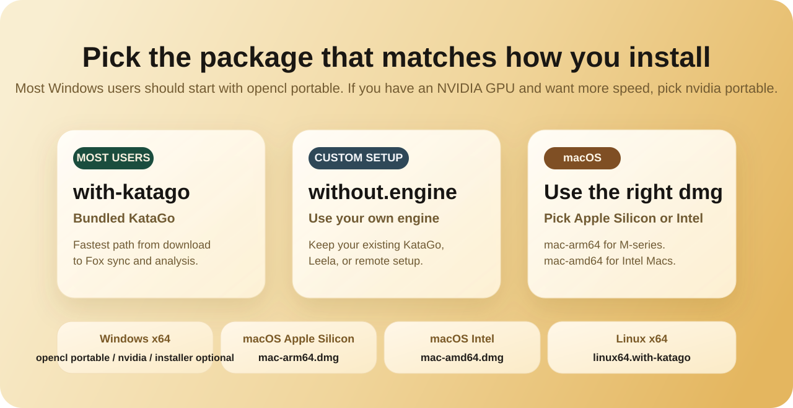
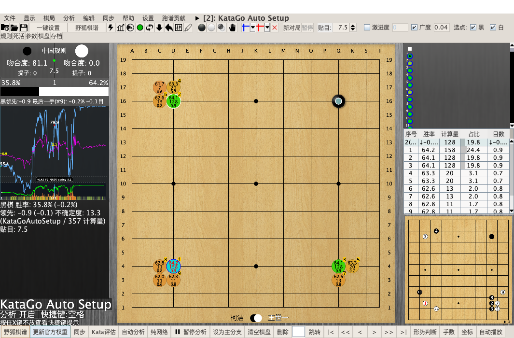
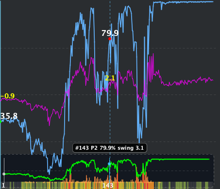

  

  
  
  
  
  

  <a href="README.md">简体中文</a> · <a href="README_ZH_TW.md">繁體中文</a> · <a href="README_EN.md">English</a> · 日本語 · <a href="README_KO.md">한국어</a> · <a href="README_TH.md">ภาษาไทย</a>

  <strong>LizzieYzy Next は、KataGo で対局を振り返る利用者向けに保守されている lizzieyzy ブランチです。</strong> 
  野狐のニックネームによる棋譜取得、全局の高速解析、新しい勝率グラフと下部概要を備え、Windows、macOS、Linux 向けに配布しています。

  <a href="https://goagent.top/"><strong>公式サイト</strong></a>
  ·
  <a href="https://goagent.top/download/"><strong>安定版ダウンロード</strong></a>
  ·
  <a href="https://pan.baidu.com/s/1wthaL8YwGMxy_u0U7Mabpw?pwd=3i8w"><strong>Baidu ダウンロード</strong></a>
  ·
  <a href="docs/INSTALL_JA.md"><strong>インストールガイド</strong></a>
  ·
  <a href="docs/TROUBLESHOOTING_EN.md"><strong>トラブル対応</strong></a>

> [!NOTE]
> 中国本土のユーザーには、安定版の [公式ダウンロードページ](https://goagent.top/download/) をおすすめします。インストーラ、Linux パッケージ、過去版は [GitHub Releases](https://github.com/wimi321/lizzieyzy-next/releases) からダウンロードできます。
>
> 中国本土から利用する場合は、公開されている Baidu Netdisk ダウンロードも使えます:
> [https://pan.baidu.com/s/1wthaL8YwGMxy_u0U7Mabpw?pwd=3i8w](https://pan.baidu.com/s/1wthaL8YwGMxy_u0U7Mabpw?pwd=3i8w)
> 取り出しコード: `3i8w`

> [!TIP]
> [中国語 QQ グループ: 299419120](https://qm.qq.com/q/JZoeojjteg)
>
> 日常の利用相談、バグ報告、機能要望のやり取りが一番速い場所です。

## 起動したあとすぐできること

| やりたいこと | いまのプロジェクトでどうできるか |
| --- | --- |
| 最近の公開野狐棋譜を取りたい | 野狐のニックネームを入力するとアプリが自動で対応アカウントを探します |
| 全局の流れを早く見たい | 一手ずつ手動で進めなくても、全局を素早く見る解析を使えます |
| 問題手を早く見たい | 新しい主勝率グラフと下部のヒート概要で大きな損失を見つけやすくなっています |
| 設定をあまり触りたくない | 推奨パッケージに KataGo、既定の重み、初回自動設定が入っています |
| インストールしたくない | Windows では `portable.zip` を優先して選べます |
| 棋盤同期も使いたい | Windows 向けの主な配布物にネイティブ版 `readboard.exe` が同梱されています |
| 高速曲線の補完で主エンジンを占有したくない | `KataGo 自動セットアップ -> ウェイト管理` から 38 MB の公式軽量モデルを必要に応じてダウンロードできます。棋譜曲線の欠落を補う間だけ起動し、通常分析の前に GPU を解放します |
| 本機の計算能力が足りない | `設定 -> リモートコンピューティング` で Zhizi クラウドコンピューティングにログインし、リモート KataGo エンジンを作成できます |

リモートコンピューティングの既定は「VIP 月額」(`--gpu-type vip-share`) です。非 VIP ユーザーは詳細設定で従量制の 1x / 3x / 6x を選べます。既定のプリセットは Zhizi 28B モデルを使用します。TensorRT と CUDA はクラウドエンジンのバックエンド名であり、料金プラン名ではありません。

保存したログイン情報は Windows DPAPI、macOS Keychain、Linux Secret Service で保護され、通常の設定には書き込まれません。安全なストレージを利用できない場合、認証情報はアプリ終了時までだけ保持されます。切断後は自動で再接続し、いつでもローカルエンジンへ戻せます。

Linux x86_64 の NVIDIA GPU サーバーがあり、まだ `WSS` リンクがない場合は、[KataGo リモート計算ワンクリックセットアップ](https://github.com/wimi321/katago-remote-one-click)を利用できます。サーバーでコマンドを 1 つ実行すると暗号化リンクと QR コードが生成され、`リモートコンピューティング -> 自前コンピューティング` で貼り付けまたは読み込めます。公開受信ポートを開く必要はありません。

## まずどれをダウンロードするか

中国本土のユーザーには、よく使う安定版を [公式ダウンロードページ](https://goagent.top/download/) から選ぶことをおすすめします。インストーラ、Linux パッケージ、過去版は [GitHub Releases](https://github.com/wimi321/lizzieyzy-next/releases) からダウンロードできます。

  

| あなたの環境 | Releases でこのキーワードを含むファイルを探す |
| --- | --- |
| Windows、RTX 20/30/40/50 NVIDIA GPU、推奨、非インストール | `*windows64.nvidia.portable.zip` |
| Windows、RTX 20/30/40/50 NVIDIA GPU、インストーラあり | `*windows64.nvidia.installer.exe` |
| Windows、AMD / Intel / 旧世代 NVIDIA GPU、非インストール | `*windows64.opencl.portable.zip` |
| Windows、AMD / Intel / 旧世代 NVIDIA GPU、インストーラあり | `*windows64.opencl.installer.exe` |
| Windows、適切な GPU がない、または GPU 版を起動できない、CPU フォールバック | `*windows64.with-katago.portable.zip` |
| Windows、CPU フォールバック、インストーラあり | `*windows64.with-katago.installer.exe` |
| Windows、RTX 30 シリーズ以前、TensorRT を任意導入 | NVIDIA パッケージから開始し、`KataGo 自動セットアップ` で TensorRT をインストール |
| Windows、DirectX 12 GPU、DirectML テスト | `*windows64.experimental.directml.portable.zip` |
| Windows、Intel GPU/NPU、OpenVINO テスト | `*windows64.experimental.openvino.portable.zip` |
| Windows、対応 AMD GPU、ROCm テスト | 対応する `*windows64.experimental.rocm.*.portable.zip` を選択 |
| Windows、自分のエンジンを使う、非インストール | `*windows64.without.engine.portable.zip` |
| Windows、自分のエンジンを使う、インストーラあり | `*windows64.without.engine.installer.exe` |
| macOS Apple Silicon | `*mac-apple-silicon.with-katago.dmg` |
| macOS Intel | `*mac-intel.with-katago.dmg` |
| Linux | `*linux64.with-katago.zip` |

CPU、OpenCL、CUDA、TensorRT、Metal の各バックエンド向けフルパッケージと Linux パッケージは KataGo `v1.18.1` を使用します。Linux NVIDIA 版は実行環境との互換性のため CUDA 12.1 を維持しています。

推奨フルパッケージには、公式フラッグシップ B11 モデル `b11c768h12nbt3tflrs-fson-silu.bin.gz`（約 202 MiB）が含まれます。RTX 3070 での比較では、探索スループットが B10 より約 40% 低く、速度を優先する場合は `KataGo 自動設定 -> ウェイト` で B10 に切り替えられます。

NVIDIA と TensorRT:

- `KataGo 自動設定` は NVIDIA GPU と Compute Capability を検出し、TensorRT が適しているかを案内します。検出に失敗しても手動で続行できます。
- RTX 40/50 は既定で CUDA を使用します。TensorRT は RTX 30 シリーズ以前で選べます。
- NVIDIA ドライバ `570.65` 以降はそのまま読み込みます。`528.33–570.64` は初回起動時に軽量推論テストを 1 回実行し、それより古いドライバでは修復状態を表示します。
- GTX 10 シリーズ以前は OpenCL を使用してください。OpenCL が不安定な場合は `*windows64.with-katago.portable.zip` に切り替えます。

## 3 ステップで開始

1. [安定版ダウンロード](https://goagent.top/download/) から環境に合うものを選び、インストーラ、Linux、過去版が必要な場合は GitHub Releases を使います。
2. `野狐棋譜` を開いて野狐のニックネームを入力します。
3. 棋譜を取得し、全局を素早く解析して、グラフと概要から重要な手へ移動します。

  

  GitHub 上で GIF の再生が遅い場合は、上の画像をクリックすると全体を開けます。

## 画面プレビュー

  

主勝率グラフと下部のクイック概要には、次の情報が表示されます。

  

- 青線 / 紫線: 双方の勝率の流れ
- 緑線: 目差の変化
- 下部のヒート帯: 全局の中で大きな問題が集まっている場所
- 縦のガイド線: 現在の手やホバー中の手の位置

## 元の lizzieyzy との違い

| 比較項目 | 元の `lizzieyzy` | `LizzieYzy Next` |
| --- | --- | --- |
| 現在の状態 | 多くの人が覚えている元プロジェクトだが、実用面の継続保守は弱い | 使用感と配布体験を継続保守する現行ブランチ |
| 野狐棋譜取得 | 古い取得フローは壊れた場面が多い | よく使う取得フローを復旧し、ニックネーム入力にも対応 |
| 入力方法 | 数字のアカウント番号を先に知っている前提が強い | 野狐のニックネームを入れるとアプリが自動で対応付け |
| KataGo 利用の敷居 | 自分で環境や不足リソースを補う場面が多い | 推奨パッケージに KataGo と既定の重みを同梱 |
| Windows での選びやすさ | 利用者が自分で判断する余地が大きい | `portable.zip` を先に勧める構成でわかりやすい |
| 同期ツール | 利用者が自分で組み合わせる場面が多い | Windows 向けの主な配布物にネイティブ版 `readboard.exe` を同梱 |

## macOS の初回起動

Mac に合うパッケージを選び、DMG を開いて `LizzieYzy Next` を「アプリケーション」へドラッグします。インストールディスクを取り出したあと、Finder の「アプリケーション」から起動してください。公式 release は署名と公証を行っています。macOS にブロックされる場合は [インストールガイド](docs/INSTALL_JA.md) を参照してください。

## ドキュメントと参加

- [サポートガイド](SUPPORT.md)
- [インストールガイド](docs/INSTALL_JA.md)
- [配布パッケージ一覧 (English)](docs/PACKAGES_EN.md)
- [トラブル対応 (English)](docs/TROUBLESHOOTING_EN.md)
- [検証済みプラットフォーム (English)](docs/TESTED_PLATFORMS.md)
- [GitHub Releases](https://github.com/wimi321/lizzieyzy-next/releases)
- [GitHub Discussions](https://github.com/wimi321/lizzieyzy-next/discussions)
- [中国語 QQ グループ: 299419120](https://qm.qq.com/q/JZoeojjteg)
- [Roadmap](ROADMAP.md)
- [Contributing](CONTRIBUTING.md)
- [Changelog](CHANGELOG.md)

## Credits

- Original project: [yzyray/lizzieyzy](https://github.com/yzyray/lizzieyzy)
- KataGo: [lightvector/KataGo](https://github.com/lightvector/KataGo)
- 棋盤同期ツール: [qiyi71w/readboard](https://github.com/qiyi71w/readboard)

readboard の継続的な保守と改善に取り組む [qiyi71w](https://github.com/qiyi71w) に感謝します。

すべてのコントリビューターに感謝します:

  

野狐棋譜取得の参考:

- [yzyray/FoxRequest](https://github.com/yzyray/FoxRequest)
- [FuckUbuntu/Lizzieyzy-Helper](https://github.com/FuckUbuntu/Lizzieyzy-Helper)

## 翻訳について

README の翻訳 PR を歓迎します。Translations are welcome; please submit a Pull Request.
