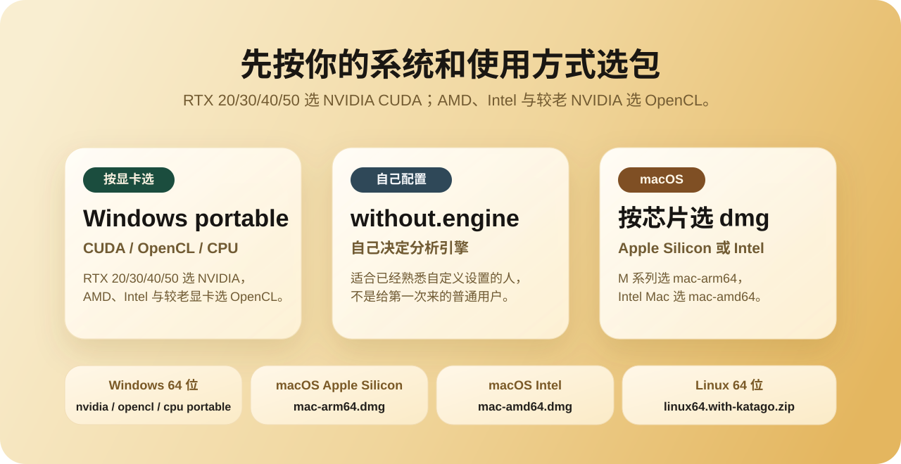
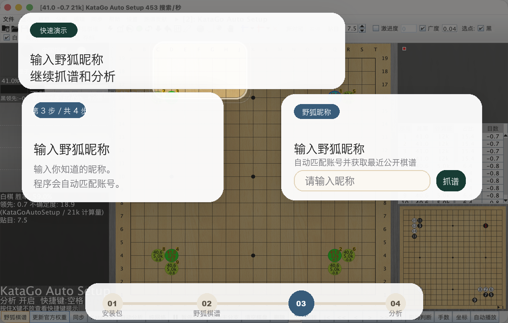

  

  
  
  
  
  

  <a href="README.md">简体中文</a> · 繁體中文 · <a href="README_EN.md">English</a> · <a href="README_JA.md">日本語</a> · <a href="README_KO.md">한국어</a> · <a href="README_TH.md">ภาษาไทย</a>

  <strong>LizzieYzy Next 是仍在維護的 lizzieyzy 分支，面向使用 KataGo 覆盤的一般棋友。</strong> 
  提供野狐暱稱抓譜、快速全盤分析、新版勝率圖和底部快速概覽，並發佈 Windows、macOS、Linux 版本。

  <a href="https://goagent.top/"><strong>官方網站</strong></a>
  ·
  <a href="https://goagent.top/download/"><strong>正式版下載</strong></a>
  ·
  <a href="https://pan.baidu.com/s/1wthaL8YwGMxy_u0U7Mabpw?pwd=3i8w"><strong>百度網盤下載</strong></a>
  ·
  <a href="docs/INSTALL.md"><strong>安裝說明</strong></a>
  ·
  <a href="docs/TROUBLESHOOTING.md"><strong>常見問題</strong></a>

> [!TIP]
> [專案討論 QQ 群：299419120](https://qm.qq.com/q/JZoeojjteg)
>
> 歡迎交流使用問題、回報 bug、分享使用體驗，或者討論接下來最想加的功能。

> [!NOTE]
> 中國大陸使用者建議從 [官方下載頁面](https://goagent.top/download/) 下載正式版；需要安裝程式、Linux 套件或歷史版本時，可使用 [GitHub Releases](https://github.com/wimi321/lizzieyzy-next/releases)。
>
> 中國大陸使用者也可使用公開的百度網盤下載：
> [https://pan.baidu.com/s/1wthaL8YwGMxy_u0U7Mabpw?pwd=3i8w](https://pan.baidu.com/s/1wthaL8YwGMxy_u0U7Mabpw?pwd=3i8w)
> 提取碼：`3i8w`

## 你打開後馬上能做什麼

| 你想做什麼 | 這個專案現在怎麼解決 |
| --- | --- |
| 抓最近公開野狐棋譜 | 直接輸入野狐暱稱，程式自動匹配帳號並抓譜 |
| 快速看整盤走勢 | 提供快速全盤分析，不用完全靠一步一步手點 |
| 快速找問題手 | 提供新版主勝率圖和底部熱力概覽，更容易一眼看出大問題手 |
| 減少快速曲線對主引擎的影響 | 可在 `KataGo 自動設定 -> 權重管理` 按需下載 38 MB 官方輕量模型；僅補齊棋譜曲線時啟動，主分析開始前即釋放顯示卡 |
| 少折騰設定 | 推薦整合包已內建 KataGo、預設權重和首次自動設定 |
| 不想安裝 | Windows 預設優先推薦 `portable.zip` 免安裝包 |
| 做棋盤同步 | Windows 主發佈包已內建原生 `readboard.exe`，同步入口更清楚 |
| 本機算力不足 | 從 `設定 -> 遠端計算` 登入智子雲端算力，建立遠端 KataGo 引擎後可像本機引擎一樣使用 |

遠端計算預設使用「VIP 包月」(`--gpu-type vip-share`)；非 VIP 使用者可在進階設定切換到按量 1x / 3x / 6x。預設方案使用智子 28B 模型；TensorRT 和 CUDA 是雲端引擎後端，不是付費方案名稱。

儲存的登入資料由 Windows DPAPI、macOS Keychain 或 Linux Secret Service 保護，不會寫入一般設定。系統安全儲存無法使用時，認證資料只保留到程式結束。斷線後會自動重連，也可隨時切回本機引擎。

若有 Linux x86_64 NVIDIA GPU 伺服器、但還沒有 `WSS` 連結，可使用 [KataGo 遠端算力一鍵部署](https://github.com/wimi321/katago-remote-one-click)。在伺服器執行一條指令即可產生加密連結和 QR Code，再到 `遠端計算 -> 自建算力` 中貼上或匯入；不需要自行開放公網連入連接埠。

## 先下載哪個

中國大陸使用者建議從 [官方下載頁面](https://goagent.top/download/) 選擇常用正式版；安裝程式、Linux 套件和歷史版本可在 [GitHub Releases](https://github.com/wimi321/lizzieyzy-next/releases) 下載。

  

| 你的情況 | 到 Releases 裡找包含這個關鍵字的檔案 |
| --- | --- |
| Windows，RTX 20/30/40/50 NVIDIA 顯示卡，推薦，免安裝 | `*windows64.nvidia.portable.zip` |
| Windows，RTX 20/30/40/50 NVIDIA 顯示卡，想安裝 | `*windows64.nvidia.installer.exe` |
| Windows，AMD / Intel / 較舊 NVIDIA 顯示卡，免安裝 | `*windows64.opencl.portable.zip` |
| Windows，AMD / Intel / 較舊 NVIDIA 顯示卡，想安裝 | `*windows64.opencl.installer.exe` |
| Windows，沒有合適 GPU 或 GPU 版本無法啟動，CPU 相容版 | `*windows64.with-katago.portable.zip` |
| Windows，CPU 相容版，想安裝 | `*windows64.with-katago.installer.exe` |
| Windows，RTX 30 系及以下，選裝 TensorRT | 先使用 NVIDIA 套件，再從 `KataGo 自動設定` 安裝 TensorRT |
| Windows，DirectX 12 GPU，測試 DirectML | `*windows64.experimental.directml.portable.zip` |
| Windows，Intel GPU/NPU，測試 OpenVINO | `*windows64.experimental.openvino.portable.zip` |
| Windows，支援的 AMD GPU，測試 ROCm | 選擇對應的 `*windows64.experimental.rocm.*.portable.zip` |
| Windows，自己設定引擎，免安裝 | `*windows64.without.engine.portable.zip` |
| Windows，自己設定引擎，想安裝 | `*windows64.without.engine.installer.exe` |
| macOS Apple Silicon | `*mac-apple-silicon.with-katago.dmg` |
| macOS Intel | `*mac-intel.with-katago.dmg` |
| Linux | `*linux64.with-katago.zip` |

完整套件的 CPU、OpenCL、CUDA、TensorRT、Metal 後端及 Linux 套件均使用 KataGo `v1.18.1`。Linux NVIDIA 仍使用 CUDA 12.1，以兼顧執行環境相容性。

推薦完整套件預設內建官方旗艦 B11 `b11c768h12nbt3tflrs-fson-silu.bin.gz`（約 202 MiB）；RTX 3070 實測搜尋吞吐比 B10 低約 40%，偏重速度時可在 `KataGo 自動設定 -> 權重管理` 切換 B10。

NVIDIA 和 TensorRT 說明：

- `KataGo 自動設定` 會偵測 NVIDIA GPU 和 Compute Capability，並提示是否適合 TensorRT；偵測失敗時仍可手動繼續。
- RTX 40/50 預設使用 CUDA。TensorRT 是 RTX 30 系及以下的選用方案。
- NVIDIA 驅動 `570.65` 及以上可直接載入；`528.33–570.64` 首次啟動時會執行一次輕量推論測試；更舊的驅動會顯示修復狀態。
- GTX 10 系及更舊的顯示卡應使用 OpenCL。OpenCL 不穩定時，改用 `*windows64.with-katago.portable.zip`。

## 三步開始

1. 到 [正式版下載頁](https://goagent.top/download/) 下載適合自己系統的套件；需要安裝程式、Linux 或歷史版本時使用 GitHub Releases。
2. 打開 `野狐棋譜`，輸入野狐暱稱。
3. 抓到棋譜後執行快速全盤分析，用主勝率圖和底部快速概覽直接定位關鍵手。

  

  如果 GitHub 裡的 GIF 載入較慢，點擊上方圖片即可查看完整動畫。

## 介面預覽

  

主勝率圖和底部快速概覽包含：

  

- 藍線 / 紫線：雙方勝率走勢
- 綠線：目差變化
- 底部熱力概覽：整盤問題手分布，紅橙黃越多越值得先看
- 垂直定位線：目前手或游標停留手的位置

## 它和原來的 lizzieyzy 有什麼不同

| 比較項目 | 原 `lizzieyzy` | `LizzieYzy Next` |
| --- | --- | --- |
| 目前狀態 | 許多人仍記得的歷史專案，但長期缺少持續維護 | 持續維護使用體驗和發佈流程的目前分支 |
| 野狐抓譜 | 舊流程在許多情況下已失效 | 已恢復常用抓譜流程，並支援暱稱輸入 |
| 輸入方式 | 更依賴事先知道數字帳號 | 輸入野狐暱稱後由程式自動匹配帳號 |
| KataGo 使用門檻 | 經常需要自行補齊環境或資源 | 推薦整合包已內建 KataGo 和預設權重 |
| Windows 下載體驗 | 使用者需要自行判斷更多項目 | 按硬體清楚區分免安裝套件 |
| 同步工具 | 經常需要使用者自行組合環境 | Windows 主發佈包已內建原生 `readboard.exe` |

## macOS 首次啟動

選擇符合 Mac 晶片的套件，打開 DMG 後將 `LizzieYzy Next` 拖到「應用程式」。退出安裝磁碟，再從 Finder 的「應用程式」資料夾啟動。官方 release 已完成簽章和公證；如果 macOS 仍阻擋程式，請依照 [安裝說明](docs/INSTALL.md) 排查。

## 文件與參與

- [取得協助](SUPPORT.md)
- [安裝說明](docs/INSTALL.md)
- [發佈包說明](docs/PACKAGES.md)
- [常見問題與排錯](docs/TROUBLESHOOTING.md)
- [已驗證平台](docs/TESTED_PLATFORMS.md)
- [GitHub Releases](https://github.com/wimi321/lizzieyzy-next/releases)
- [GitHub Discussions](https://github.com/wimi321/lizzieyzy-next/discussions)
- [QQ 群：299419120](https://qm.qq.com/q/JZoeojjteg)
- [專案路線圖](ROADMAP.md)
- [參與貢獻](CONTRIBUTING.md)
- [更新日誌](CHANGELOG.md)

## 致謝

- 原專案：[yzyray/lizzieyzy](https://github.com/yzyray/lizzieyzy)
- KataGo：[lightvector/KataGo](https://github.com/lightvector/KataGo)
- 棋盤同步工具：[qiyi71w/readboard](https://github.com/qiyi71w/readboard)

感謝 [qiyi71w](https://github.com/qiyi71w) 持續維護和改進 readboard。

感謝所有參與提交的貢獻者：

  

野狐抓譜參考：

- [yzyray/FoxRequest](https://github.com/yzyray/FoxRequest)
- [FuckUbuntu/Lizzieyzy-Helper](https://github.com/FuckUbuntu/Lizzieyzy-Helper)

## 參與翻譯

歡迎提交 README 翻譯 PR。Translations are welcome; please submit a Pull Request.
