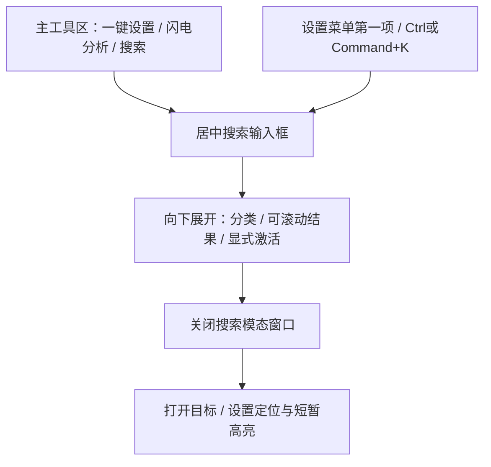

# 搜索导航 UI 设计依据

Design version: 00-r2 (approval candidate)
Status: blocked — user approval and Windows system-scale 150%/200% acceptance pending
Scope: ticket 00, isolated Swing prototype; 01 must not start.

## 方向与参照

Operate 场景：复盘中快速找到入口；主棋盘不重排，输入框保持位置，下方展开结果。暖白纸面 `#FFFDF8` / 背景 `#F8F5EE`，墨绿 `#0A655E`，主文字 `#232724`，次文字 `#53615B`，细线 `#CDBF9F`，选中底 `#E8F1EC`。金色只用于定位边框；正文不用低对比浅金。系统 UI 字体起步，通过 `LocaleFontSupport.resolveLanguageFontName` 保留多语言 fallback。

基线 `e3b6d918e203dfb97312013191bc8e3364886680`。本轮已在 Windows 运行该基线 shaded JAR 的真实主窗口及一键设置权重/加速窗口，独立配置目录，不使用日常配置。证据在 `D:\dev\weiqi\acceptance\function-search-design-00\reference-visible\real-setup-{weights,acceleration}.png`。`ReferenceCapture.java` 是实际应用窗口的采集驱动；原型不依赖或构造这些业务窗口。首次被其他窗口遮住的采集无效，未作为参照。

观察：权重页为暖白内容＋墨绿分区导航，按钮圆角细线，列表低饱和绿底、独立选中标识；加速页沿用相同导航与字体，不能把其大侧栏/推荐卡片迁入搜索。原规划 `setup-style-samples.png` 仅为离屏绘制探针，和真实窗口、此原型严格区分。

## 入口与窗口关系

生产布局决定：在 `Menu` 创建顶部 `centerArea` 的 `btnFlashAnalyze` 后加入紧凑搜索按钮；宽窗口为放大镜＋本地化“搜索功能…”，窄窗口收为放大镜，保留 tooltip/无障碍名称。先收搜索文字，不改变其他已有入口顺序，不新增棋盘侧栏。`TopHeaderPanel` 的 WrapLayout 是既有约束；01 验证紧凑宽度不能为新增按钮多挤出一排工具栏。

第二入口为“设置”菜单第一项；Ctrl+K / macOS Command+K 共用搜索窗口。原型提供一个独立模拟主窗口，顶部按钮和设置菜单都可操作，棋盘为示意图；它不声称重建真实主工具栏。主窗口关系：菜单 → 原工具区中搜索入口 → 棋盘上方的 owned modal 搜索；任何展开只改变浮窗，不改变棋盘尺寸。



实际 `TopHeaderPanel` 注入视觉探针：1100 宽时工具区高 52→52，760 宽时 70→70，未增加工具行；其他控件与棋盘画面保持原位置。宽入口在本机原工具栏尺寸为 93×16，窄入口为 32×16。`header-fit/header-{1100,760}-{before,after}.png` 是真实基线主窗口加一个无业务动作按钮的对照，不是生产搜索接入。原型可操作入口在 owner 宽度低于 900 时转为图标，保留名称与 tooltip；单独 mock host 的点击区域较大，不作为真实工具栏几何证明。

## 浮窗与结果

- 输入框位于所属窗口中央，常见宽 720 logical px；左右至少留 24 px。首行约 52 px，随字体增大；查询前只展示输入与“浏览功能”。
- 输入后下方展开分类、候选、底部激活动作，“浏览功能”让位给列表；输入的屏幕 Y 不随内容变化。展开下边距 16 px，列表独立滚动，不把浮窗整体重新居中。
- 原型常见 owner 1100×800，紧凑 760×580；实际可用屏幕小于此值时按工作区缩小。默认字号 14，控件提供 12/14/18/22 以检验放大字体。01 继承现有 `Config.frameFontSize`，不将原型 14 变成全应用默认。
- 行内容先功能名称（加粗），随后真实路径（次级色）；原生 styled text/文本区按 viewport 宽度换行、计算行高，不靠横向滚动或省略号隐藏名称。所选行就地展开类型、已有快捷键、使用提示或不可用原因，没有独立详情面板；极端大字体使单行高于 viewport 时，纵向滚动阅读整行。
- 空查询可点“浏览功能”查看分类；查询为演示子串匹配，可用 `weights` / `acceleration` / `sync` 等样本 ID。无结果显示恢复建议；分类切换、移动选中不执行。
- 不可用结果仍可选中，原因可读，激活按钮禁用；模拟 sync 固定不可用，不是真实机器判断。
- 键盘焦点以独立墨绿外框、纸色间隔和标准 caret 表示；墨绿主按钮的填色与焦点框间留可见纸色空隙。选中以低饱和绿底表达，两者不是同一状态。键盘提示的上下箭头为 Java2D 线条图标，不依赖物理字体包含箭头字形。

## 示例目录与源码依据

| 示例标题键 | 路径资源键 | 类型/快捷键 | 源码依据 |
|---|---|---|---|
| BottomToolbar.downloadWeight | Menu.settings > Menu.autoSetup > AutoSetup.navWeights > AutoSetup.officialWeightTab | 定位 | LizzieFrame:20990–21004; KataGoAutoSetupDialog:475–477 |
| AutoSetup.accelerationTitle | Menu.settings > Menu.autoSetup > AutoSetup.navAcceleration | 定位 | KataGoAutoSetupDialog:484–486,1030–1059 |
| Menu.alwaysShowBlackWinrate | Menu.viewMenu > Menu.Suggestions | 设置示意定位 | Menu:1427–1440 |
| Menu.wholeGameDeepAnalysis | Menu.analyze | 操作 / Ctrl+Shift+B | AutoAnalyzeMenu:65–72; Menu:3400–3403 |
| Menu.batchAnalyze | Menu.analyze | 操作 / Ctrl+O | Menu:3355 起; Input:539–545 |
| Menu.engineRules | Menu.settings | 定位 / Shift+D | Menu:5281–5289; Input:742–747 |
| GameInfoDialog.komi | Menu.edit > Menu.setInfo | 定位；I 为父窗口入口，不是字段快捷键 | GameInfoDialog:96–98,149 起; Input:505–512 |
| Menu.readBoard | Menu.sync | 操作 / Alt+O | Menu:4187–4189; Input:539–545 |

文件前缀 `src/main/java/featurecat/lizzie/gui/`。目录仅八个语料，不是完整覆盖清单。黑方胜率使用当前真实菜单路径，不声称当前综合设置已有可见行；01 的真实综合设置目标保持既有票据要求。样本没有不明路径；后续不能核实的路径必须省略并在生产覆盖清单说明。

## 激活、取消与定位顺序

1. 查询、选中、滚动均只改原型内存。
2. 点击激活、双击行或非组合态 Enter 才移交；不可用项不移交。
3. 先 dispose 搜索，再在 EDT 后续回调打开模拟目标，避免 owned modal 阻挡目标。
4. 设置演示窗口滚动到目标行、请求焦点、金色边框高亮 2.4 秒；结束后边框恢复，反馈显示值未改变。每个目标窗口拥有自己的计时器，关闭旧窗口不取消新窗口的高亮结束。
5. Esc 取消搜索，焦点回到打开入口，动作计数不增加。

目标窗口、行滚动、焦点和计时高亮是真实 Swing 操作；目标内容和可用性是模拟。没有配置保存、引擎、下载、ReadBoard 或棋谱操作。原型不承诺 IME Enter 隔离、完整目录排序、真实危险动作保护、生产焦点恢复和生命周期；这些仍是 01–04 门禁，不能以本票演示通过替代。

## 六语言、DPI 与主题证据边界

八份资源同改，新增 PrototypeSearch 文案由 AppLocale.loadBundle 读取，标题沿用真实资源。六种显式语言为简中、英文、韩文、日文、繁中、泰文。

已运行 Windows JDK 21 gallery：三档 `sun.java2d.uiScale=1/1.5/2` × 常见 14pt/紧凑 22pt × 六语言。输出位于上述运行根目录的 `final-{1,1.5,2}-{normal14,compact22}/`，含 collapsed、locale-1…6、unavailable、no-results、surround-1/2、target-highlight、target-ended。这是 Windows 原生 Swing 在强制 Java 缩放下的可见窗口截图；没有更改 Windows 系统缩放，也不证明跨显示器 DPI 切换。

修复后 NativeSmoke 的紧凑泰文 22pt 行子控件水平溢出由 177 px 降为 0；可见提示文字通过字体字形检查，上下箭头用绘制图标。列表、无结果及目标反馈都使用原生文本换行。Windows 当前原生系统环境测得 96 DPI、1.0× device transform；150%/200% 系统设置尚未切换，不能用 Java 强制缩放代替该项验收。继续该项需要在 Windows 桌面将显示缩放设为 150%、200% 后分别重启原型并采集，最后恢复 100%；本轮未改用户的系统显示设置。

真实主题 API 对照：独立 `Config.createForTests` 内存状态（无生产主窗口/引擎/配置读写），依次调用真实 `AppleStyleSupport.applyUiDefaults`，以默认/Apple/Morandi 三组默认值创建原型；对每个自绘按钮执行真实 `preserveCustomButtonStyle` + `installButtonStyle`，验证绘制器保留并截图。类别和语言等标准控件显式设置本地纸色/墨色，不继承 Apple 的白字到浅底。证据 `actual-theme-final/actual-style-api-{0,1,2}.png`。这验证真实样式 API 与原型的组合，不声称生产搜索已注册全局主题刷新生命周期。真实应用三主题参照另在 `reference-themes/real-main-style-{0,1,2}.png`；原型底部外观选择器仅切换示意衬底。

交互录屏：`D:\dev\weiqi\acceptance\function-search-design-00\smoke-final\interaction.gif`。录制仅采集此原型所属窗口区域；鼠标点击工具栏和设置菜单、方向键/Enter/Esc/Ctrl+K 为 Windows Robot 原生输入，查询字符串按字符写入 Swing Document 以稳定展示输入变化，不是 OS IME 证据。包含分类、无结果、不可用、取消、目标移交、滚动聚焦和高亮结束。原型本身可由用户直接输入。

聚焦检查：`LocalizationResourceParityTest` 通过；`scripts/check_line_endings.py` 通过。NativeSmoke 覆盖两个入口、原生快捷键、静止输入锚点、分类筛选、选中不执行、不可用不执行、Esc 焦点返回、Enter 先关模态后开目标、高亮结束及泰文溢出。TimerSmoke 的 A→B→关闭 A 场景，修复前 B 保持初始反馈，修复后 B 在期限后显示结束反馈。

## 复用清单

可直接调用：`AppLocale.loadBundle`、`LocaleFontSupport.resolveLanguageFontName`；生产还可调用 `AppleStyleSupport.preserveCustomButtonStyle`、已有 JFontTextField/JFontButton/JFontLabel/JFontMenuItem 和 `Utils.changeFontRecursive`。

借鉴规则：`KataGoAutoSetupDialog` 的状态色、按钮 hover/pressed/disabled、列表层级、`ResponsiveActionRow` 的窄宽度重排。`WeightButtonUI`、`RoundedSurfacePanel`、列表 painter 为私有嵌套类，原型自带少量纯绘制；01 若形成第二个生产调用者，只提取必要绘制片段并同步原调用者，不建立全应用主题框架。必须保持原一键设置外观不变。

## 运行与版本

原型 checkout：`/home/dev/dev/weiqi/worktrees/lizzieyzy-next/function-search-ui`。
分支：`prototype/function-search-ui`；起点为上述基线。原型提交：`1cb47df6`（`feat(prototype): add function search demo`）。

从原型工作树根目录：

```sh
bash prototype/function-search-ui/run.sh
```

Windows 本地副本：

```powershell
pwsh -NoProfile -File prototype/function-search-ui/run.ps1
```

两者只需 JDK 17+（本轮 Windows 使用 21），临时编译三个隔离类，不运行生产 main。Windows launcher 支持 `-Scale 1.5 -FontSize 22 -Compact` 和 `-Gallery <directory>`。交互演示可用语言/外观/字号/紧凑控件调整，不保存设置。

## 审查与确认

修复模式审查结论：`SUCCESS`。Standards 与 Spec 分别完成 FULL_REVIEW 和针对修复的 VERIFICATION，父代理核对两轮冻结输入未变。STANDARDS-C1（独立目标计时器）、SPEC-001（紧凑入口及真实工具栏适配）、SPEC-002（长译文与字形）、SPEC-004（交互录屏）均 resolved；SPEC-003 与 STANDARDS-C1 重复，合并记账。视觉 V1/V2/V3 均 resolved，finish disposition 为 `ship`；当前不可用的 Impeccable finish agent 由通用只读 reviewer 按同一视觉修复范围替代。开放 IN_SCOPE 0，DEFERRED 0，follow-up 0。此结论只覆盖原型修复，不清除外部验收门禁。

设计候选为 00-r2，对应原型 `1cb47df6`，用户确认尚未发生。Windows 系统缩放 150%/200% 未验；00 保持 blocked，01 不可开工。本地 `.scratch` 是票据依据；提交到 `docs/plans/2026-09-12-function-search-ui-design.md` 的同版快照用于跨工作树交接。完整 acceptance 状态在票据 Completion record；原生运行记录在证据目录 `acceptance-record.json`，本地副本来源封存在 `prototype-provenance.json`。
