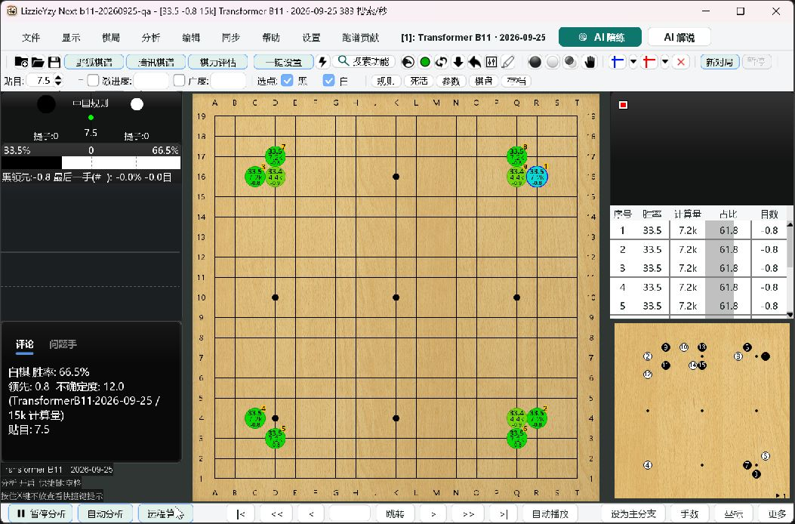
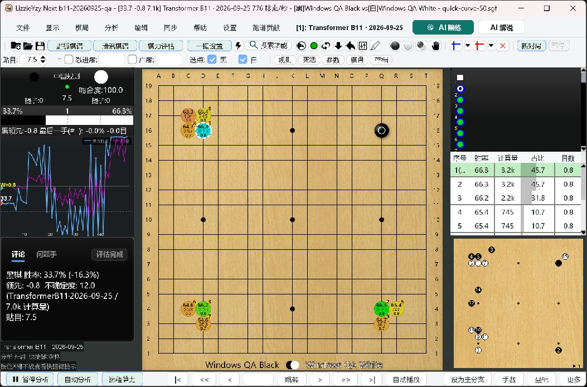
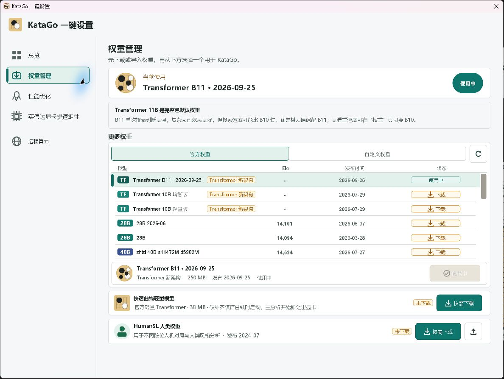
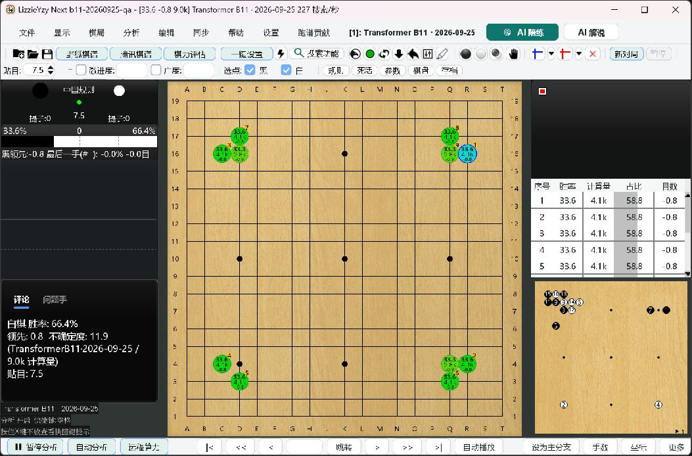

# B11 September 25 Model Acceptance

## Scope And Identity

This focused update changes the default model pin, not engine algorithms or
user model migration. It was integrated with main `b7285159` after UI PRs #550
and #551 passed their checks and were merged.

The [official training site](https://katagotraining.org/networks/) identified
`kata1-tf3-b11c768-s12002M-d6304M` as both its latest and strongest confidently
rated network when checked on September 26, 2026. Its publication timestamp is
September 25, 2026, 02:06 UTC. Ratings are approximate, not a guaranteed gain.

- [Official model download](https://media.katagotraining.org/uploaded/networks/models/kata1/kata1-tf3-b11c768-s12002M-d6304M.bin.gz).
- Downloaded size: `262017809` bytes, approximately 250 MiB.
- Computed SHA-256 of the official HTTPS download:
  `4a6312e80faadee7b7dd28689a2e87a1efb4640c10132f16290da7a17b4c6d9e`.
- Gzip was read to EOF with checksum verification; decompressed size is
  `281905898` bytes. The header names this network and model format version 17.
- The packaged destination remains `weights/default.bin.gz`.
- KataGo remains v1.18.2, project-built from pinned official source commit
  `47aadc08518b3e121f22539796c911002f699584`. Engine/runtime versions do not change.

The catalog, four platform packaging audits, current installation guides and
golden tests use the new identity. Historical release notes remain unchanged.
B10 remains an explicit on-demand choice. No weight is downloaded or replaced
by a core-only application update.

## Automated Verification

Environment: Windows 11 Pro 23H2, build 22631.6199; JDK 21.0.2; Maven 3.9.6;
Python 3.12.14. Commands ran in an isolated managed worktree.

| Check | Result |
| --- | --- |
| Model-only full `mvn -B -Djava.awt.headless=true -Dfmt.skip=true verify` | 4,388 unit tests, 0 failures/errors, 92 conditional skips; 7 integration tests, 0 failures/errors, 6 skips; BUILD SUCCESS, 4m52s |
| Combined UI + model full Maven verify, same arguments | 4,416 unit tests, 0 failures/errors, 92 conditional skips; 7 integration tests, 0 failures/errors, 6 skips; BUILD SUCCESS, 5m00s |
| Final catalog/setup/model-preservation focused tests | 117 tests, 0 failures/errors, 4 conditional skips; BUILD SUCCESS, 26s |
| `mvn -B -Djava.awt.headless=true -Dfmt.skip=true -DskipTests package` | BUILD SUCCESS, 8s; the combined verify also rebuilt and exercised the shaded JAR |
| `python scripts/run_local_ci.py --profile all --group scripts` | All 60 steps passed, 276s; 609 Python tests across 43 invocations, 14 conditional skips; includes launcher, asset, JCEF, NVIDIA runtime, publishing and shell/PowerShell checks |
| `python scripts/run_local_ci.py --profile all --group repository` | All 4 steps passed; 6 checker tests passed; LF, Markdown links and diff clean |
| `windows_smoke_test.ps1 -LauncherOnly -OpenAutoSetup -PreserveConfig` | Packaged JVM stayed healthy; injected options restored; no process left in the test directory |

`LoggingProviderSmokeIT` executed against the actual shaded artifact, rather
than being counted as an unexecuted integration test.

Four new regression cases cover explicitly selected old B11, B10, custom
weights, and core-only upgrades preserving the existing default model bytes
and manifest. Display-name checks prevent old B11 files being relabeled with
the new date. The first focused run exposed an omitted configuration fixture
initialization in the new test; it was corrected before both successful full
runs. No production migration change was needed.

## Real Engine Checks

GPU: NVIDIA GeForce RTX 3070 Laptop GPU, 8 GiB; driver 560.76. Each test used
the verified new model, an isolated working directory and `homeDataDir`.
CPU/OpenCL/TensorRT source archives were checked against catalog SHA-256 pins.
TensorRT reused existing isolated test DLLs read-only, not a system installation.

The existing `scripts/measure_analysis.py` ran with the opening fixture,
8 search threads and batch size 16. Each backend returned positive root visits,
acknowledged stop, and exited normally. These are bounded compatibility checks,
not matched-budget performance comparisons or official benchmark results.

| Backend | Visits budget | Engine readiness | First search response | Completion |
| --- | --- | --- | --- | --- |
| CUDA | 128 | 4.52s | 0.135s | 0.460s, 157 observed visits |
| CPU/Eigen | 8 | 3.04s | 2.077s | 6.953s, 9 observed visits |
| OpenCL | 32 | 197.00s, including first tuning | 0.233s | 0.455s, 34 observed visits |
| TensorRT | 32 | 54.09s, including first engine build | 0.191s | 0.409s, 34 observed visits |

CUDA JSON analysis additionally completed all nine opening positions in 2.68s
and acknowledged cancellation in 0.047s. Cold-cache work must not be presented
as a hang or hidden by claiming only steady-state search time.

## Visible Windows EXE

Test executable: `LizzieYzy Next NVIDIA.exe`, copied from the previously
verified NVIDIA portable into a separate directory. Its bundled Java runtime
was retained. Only the candidate JAR, test model, test manifest and explicit
test work-directory setting changed; no existing user-data was copied.

Candidate JAR SHA-256, equal in `target` and the EXE's `app` directory:
`3703d7bcb2fe63f1f876b00117d91f10d2608a1c8f21544ab1880ae43f268bc2`.

| User action | Observed result |
| --- | --- |
| Fresh EXE launch | Ordinary Chinese main window; automatic CUDA analysis; no initial setup dialog; correct B11 date in engine title |
| First configuration save | `first-time-load=false`, `default-engine=0`, `autoload-default=true` |
| Toolbar folder, ordinary SGF open | Loaded `quick-curve-50.sgf`; full real win-rate/score curve and completed evaluation were visible at the first follow-up screenshot, 15.2s after opening |
| Quick curve completion | Foreground analysis resumed; log contains one engine process start for the entire initial session, not a second analysis process |
| Two recommended-point clicks | Stones appeared and current-position analysis resumed; small board remained available |
| One-click Setup overview | Shows `Transformer B11` dated `2026-09-25` and running engine state |
| Model page | New B11 is first and in use, size 250 MiB; B10 remains downloadable; optional lightweight and HumanSL downloads remain separate |
| Normal exit and restart | B11 automatically loads again without an initialization dialog; positive visits resume |

An initial `Ctrl+O` exercise intentionally entered the application's batch
analysis path, which opens an analysis-settings dialog. The ordinary-open
curve assertion above instead used the toolbar folder button. Batch behavior
was not misreported as an automatic-curve failure.

The UI matrix from the [UI acceptance report](ui-workbench-2026-09-26.md)
remains applicable to unchanged UI code: six-language sampling, actual system
100/150/200% scaling and NVDA checks. The combined-model pass used the restored
150% setting; it did not repeat every language/DPI permutation.

## Evidence And Limits

Local evidence root: `C:\ailearn3\lizzieyzynext\.qa\b11-20260925`.
It contains per-backend manifests, commands, stdout/stderr, results, Maven logs,
launcher log and screenshots. Original logs, models, engine binaries, caches
and configuration directories are not committed or uploaded.

This machine does not validate macOS/Linux hardware, RTX 50, AMD/Intel
experimental backends, authenticated cloud sessions, paid AI replies or a
complete HumanSL game. Multi-platform build/signing/provenance checks and final
downloaded-package acceptance are separate release gates, not results claimed
by this model PR. No release is published by this report.
