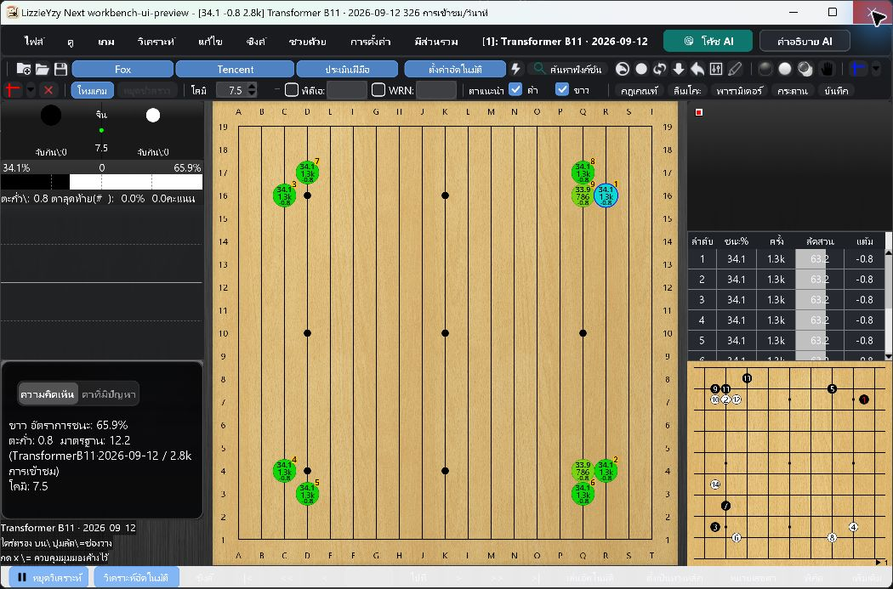

# Swing Workbench UI Candidate - 2026-09-26

## Acceptance Status

**INCOMPLETE: do not mark this candidate fully accepted or release it.**

The implementation and automated checks are available in the isolated
`ui/unified-analysis-workbench` worktree. No merge or release is authorized.
The user explicitly accepted deferring actual screen-reader speech and complete
child-dialog keyboard workflows. Submit a draft UI PR with these gates visible;
do not claim unconditional acceptance or merge it.

- Latest checked `origin/main`: `50898233f5cce7d952b37cdb9ee005f780ea948f`.
- Candidate base also includes `ee774cac8df2150c5349492059f83a99327d9ab2`, the
  refresh-icon change in open PR #550. That PR has not been merged by this task.
- Windows 11 Pro 23H2, build 22631; NVIDIA RTX 3070.
- Build JDK: 21.0.2. Portable runtime: Eclipse Adoptium 21.0.12.1+1-LTS.
- Portable: `target/ui-qa/portable/LizzieYzy Next NVIDIA.exe`.
- Final shaded JAR SHA-256:
  `f06ea80ae4eda702ba663f99d404f928f3cfc2f4b6d59e65d8d58eb50ad9eb07`.
- Only isolated portable configuration, weights and caches were used. The
  original dirty workspace and real user configuration were not changed.

## Implemented Scope

- Shared light/dark surfaces, semantic text colors, teal actions, font selection
  and focus treatment in `AppleStyleSupport`.
- Neutral default main background, themed analysis table and restrained sidebar
  chrome. Explicit wallpaper, theme, font, curve colors and layout remain intact.
- Compact general settings navigation, adjacent label/control rows, wrapping
  descriptions and a persistent save/cancel footer. Navigation uses real buttons
  with names, Enter/Space activation and a visible focus ring.
- Remote compute typography and surfaces, full model-name tooltips, preserved
  refresh icon and a dark-safe combo box painter.
- Setup overview with readiness/model information first, expandable technical
  paths and copy action, one existing weight catalog instead of duplicate
  recommendation cards. Download, apply, import and B11 notices remain separate.
- AI training and commentary share the palette and form styling. Training
  behavior, engine protocols, connection/account handling and task lifecycle were
  not changed. No configuration migration was introduced.

## Automated Checks

Commands use the repository's Maven configuration with formatter auto-edits
disabled. Formatting was restricted to the UI files changed in this task.

```text
mvn -B -Djava.awt.headless=true -Dfmt.skip=true verify
python scripts/test_windows_launcher_packaging.py
python scripts/check_line_endings.py
git diff --check
```

Final full rerun: **BUILD SUCCESS**, 5 minutes 52 seconds. Unit tests: **4,402**,
failures **0**, errors **0**, skipped **92**. Integration tests: **7**, failures
**0**, errors **0**, skipped **6**. `LoggingProviderSmokeIT` executed successfully
against the shaded JAR. All three crash-barrier tests also passed in this full
rerun. Log: `target/ui-verify-dark-toolbar-final.log`.

The non-headless desktop/component lane originally failed: 87 tests, one failure,
zero errors/skips. Production settings navigation found the target and focused
it, but its row extended outside the viewport. Settings pages now track viewport
width and recalculate height, including wrapped nested control groups. The
subsequent 88-test desktop rerun passed with zero failures/errors/skips. After
adding the bottom-toolbar contrast regression, the final desktop lane passed:
**89 tests, 0 failures, 0 errors, 0 skipped**, in **25.911 seconds**. Log:
`target/ui-desktop-components-accepted.log`. This lane starts the production
Swing application in an isolated JVM, but is not a manual screen-reader or EXE
acceptance substitute.

```text
mvn -B -Djava.awt.headless=false -Dfmt.skip=true -Dtest=ConfigDialog2NavigationTest,WorkbenchStyleTest,AccessibilitySupportTest,RemoteComputeDialogLayoutTest,RemoteComputeRefreshButtonTest,KataGoAutoSetupDialogLayoutTest,MenuAiFeatureButtonLayoutTest test
```

Earlier complete candidate: 4,399 unit tests, zero failures/errors, 92 skipped;
7 integration tests, zero failures/errors, 6 skipped. `LoggingProviderSmokeIT`
actually executed against the shaded JAR. `verify` included packaging.

After adding the settings navigation regression, one full run reported 4,400
unit tests with one failure in the existing
`CrashPersistenceBarrierTest.fatalBarrierWaitsThroughDequeueHandoff`: the 3-second
handoff latch timed out. No logging source was changed. Isolated rerun of that
class and `WorkbenchStyleTest` passed (14 tests, zero failures/errors/skips),
including all three crash-barrier cases. Keep the failed run as evidence rather
than treating the isolated rerun alone as a full-suite pass.

Launcher packaging guards, line-ending checks and `git diff --check` passed.
Real launcher smoke with `-LauncherOnly -OpenAutoSetup -PreserveConfig` passed
using the portable runtime, with no failed-JVM dialog. `-PreserveConfig` is
mandatory for this fixture. Final launcher log:
`target/ui-launcher-smoke-final-accepted.log`.

New component tests cover light/dark text contrast (at least 4.5:1 for tested
normal/secondary/status text), opaque combo surfaces, custom theme retention,
wrapped labels, user fonts, stable button bounds/focus, analysis table styling,
six-language row boundaries and accessible navigation buttons. These tests are
not a substitute for a screen reader or physical system-DPI testing.

## Actual Windows UI Observations

| Scenario | Observed result | Scope |
| --- | --- | --- |
| Portable EXE | Starts with bundled Java | Real EXE, not `java -jar` |
| Local CUDA/B11 | Model loads and returns real analysis, roughly 260-400 visits/s observed | RTX 3070 only; not a benchmark |
| SGF and quick curve | Opened the existing 50-move QA SGF through the ordinary toolbar/file-picker path; curve appeared and completed | Final JAR, actual 150% Windows scale |
| Recommended moves | Two consecutive suggested moves were placed; analysis resumed and small-board PV remained visible | Real pointer input |
| Main chrome | Lightning analysis, KataGo ownership and small-board entry points retained | Normal and maximized preview |
| General settings | Compact sidebar, wrapping content, persistent footer visible | Visual checks; full interaction acceptance pending |
| Setup overview/weights | Readiness and models readable, technical detail actions retained | Chinese and Thai dark previews |
| Setup performance/NVIDIA | Vertical content scroll reaches lower actions; no whole-page horizontal scroll observed | Thai high-scale preview; final dark combo rechecked |
| Remote compute | Dark combo text and refresh control visible after fix | Logged-out UI only; no credentials entered |
| AI training/commentary | Forms/input controls retain structure and use shared styling | UI preview only; no model download or paid API calls |

### Locale And Scaling Matrix

The first matrix used **JVM scale overrides**, not changes to Windows display
scaling. It is a sample matrix, not all six languages multiplied by every screen
and scale. Native Windows scaling was subsequently inspected: the original value
was 150%, at 2560 x 1600 resolution.

| Locale | JVM scale | Windows inspected |
| --- | --- | --- |
| Simplified Chinese | 1.5 and native/no override | Main, settings, setup, training, commentary, remote; real SGF/engine |
| Traditional Chinese | 2.0 | Main, settings, theme section |
| English | native/no override | Main, settings |
| Japanese | 1.0 | Main, settings, training |
| Korean | 1.5 | Main, settings |
| Thai | 2.0, dark theme | Main, settings, setup pages, remote |

Actual Windows display scaling was also changed in Settings, with the EXE closed
and restarted each time and **no JVM scale override**:

| System scale | Locale/theme | Observed windows |
| --- | --- | --- |
| 100% | Simplified Chinese/light | Main with B11, general settings, remote, training including More, commentary |
| 150% | Simplified Chinese/light | Final EXE, ordinary SGF load, completed quick curve, two recommended moves and resumed analysis |
| 200% | Thai/dark | Main with B11, general settings, setup overview/weights/performance/NVIDIA, remote, training, commentary |

Windows display scaling was restored to its original **150%** before the final
EXE/SGF check. The final launcher configuration has no JVM scale override.
`Ctrl+O` intentionally opens the existing load-and-analyze settings flow; the
ordinary folder toolbar entry was used to verify automatic quick-curve loading.

Setup page selection and vertical scrolling were exercised with pointer input.
Esc closed general settings, remote, training and commentary in sampled runs;
this does not prove the full keyboard traversal requirement. General-settings
sidebar pointer activation was not reliably exercised by the window-control
tool and remains a manual gate; production navigation and component hit-surface
tests passed.

Screenshots from this Windows capture tool can lose thin glyph/grid strokes
when resampled. They must not be used alone to diagnose missing board lines or
to claim that every font glyph was checked at native resolution.

## Issues Found During This Pass

- Windows native combo painting left white backgrounds under light text in dark
  mode. Replaced the affected combo delegates with shared BasicComboBoxUI
  styling; added an opaque-background/contrast regression and rechecked remotely
  visible controls without signing in.
- Setup status colors and weight-row surfaces were light-theme-only. Added
  semantic light/dark colors and rechecked the Thai dark preview.
- Generic text styling made wrapping descriptions look like editable fields;
  generic button styling could override the save action. Preserved custom styles
  and added component regressions.
- Settings navigation was a non-focusable JPanel. It is now a named button with
  one hit surface and keyboard actions. Component checks pass. The final manual
  navigation pass remains open because of the input-tool limitation below.
- Production settings navigation failed because a fixed-width panel did not
  track the viewport. Corrected scroll sizing and multi-control row wrapping;
  the real desktop navigation probe and new nested-control boundary tests pass.
- Actual 200% dark-theme inspection revealed a light bottom-toolbar background
  beneath light button text when Morandi colors were disabled. The bottom bar
  now uses the shared theme painter; a contrast regression covers both themes.
  Rechecked with the final JAR at actual Windows 200% in Thai/dark mode.

## Selected Visual Evidence

These are unedited captures from this acceptance task, not mockups. The initial
settings comparison has different window sizes/scales, so it demonstrates
structure and spacing rather than a pixel-identical baseline comparison.

1. General settings before: distant labels/controls and decorative background.

   

2. General settings after: adjacent controls, compact navigation and persistent
   footer at actual Windows 100%. Full manual navigation remains a pending gate.

   

3. Dark toolbar before and after the contrast fix, actual Windows 200%, Thai.

   

   

4. Final real B11 analysis and completed SGF curve at actual Windows 150%.

   

## Remaining Acceptance Gates

- Real Tab/Shift+Tab, Enter/Space/Esc workflows across all target dialogs and
  actual NVDA or Narrator output. The available Windows tool exposes only the
  main HWND, activates/restores that window before sending input, and can pull
  focus away from owned Swing dialogs. Do not call this a keyboard/reader pass.
- Complete six-language coverage of all final dialogs, including long model
  names while connected, theme-save/reopen and keyboard-only operation.
- macOS and Linux hardware acceptance. Windows results do not cover them.
- Monitor the pre-existing crash-barrier timing failure seen once during the
  full suite. Its isolated rerun passed; no unrelated logging fix is included.

## Evidence Locations

All paths below are local to the Windows test machine.

- Worktree: `C:\Users\kk\.codex\worktrees\unified-workbench-ui\lizzieyzynext`.
- Before screenshots: `C:\ailearn3\lizzieyzynext\.worktrees\remote-model-refresh-icon\target\design-audit-20260926`.
- After screenshots: `C:\ailearn3\lizzieyzynext\.qa\ui-workbench-20260926\screenshots`.
- Final SGF/quick-curve screenshot: `46-final-sgf-curve-system-150.png`.
- Final consecutive-move screenshot: `47-final-recommended-moves-system-150.png`.
- Restored original Windows scale: `45-system-scale-restored-150.png`.
- Settings final dark screenshot: `23-settings-dark-sidebar-final-native.png`.
- Settings final light screenshot: `25-settings-light-final-native.png`.
- Dark NVIDIA combo recheck: `22-nvidia-dark-final-native.png`.
- Logs under worktree `target`: `ui-full-verify-final.log`,
  `ui-verify-sidebar-final.log` (one failure), `ui-recheck-concurrency.log`,
  `ui-verify-accepted-candidate.log`, `ui-verify-dark-toolbar-final.log`,
  `ui-desktop-components-accepted.log`,
  `ui-launcher-smoke-final-accepted.log` (final JAR, passed).

Do not publish test user-data, runtime caches, engine binaries or account data
with a future UI pull request. Attach reviewed screenshots and this report only.
