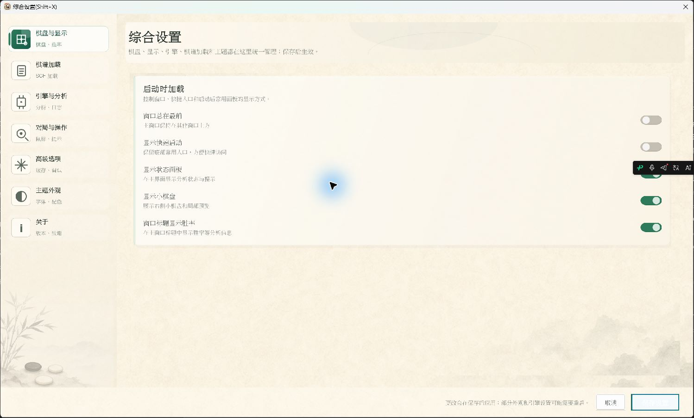
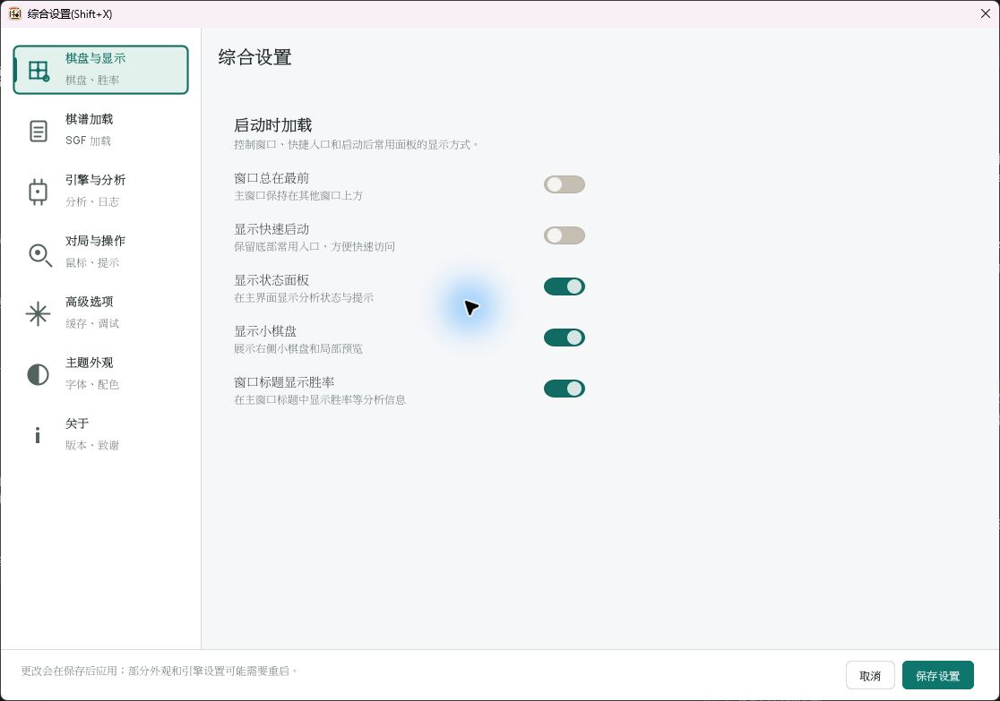
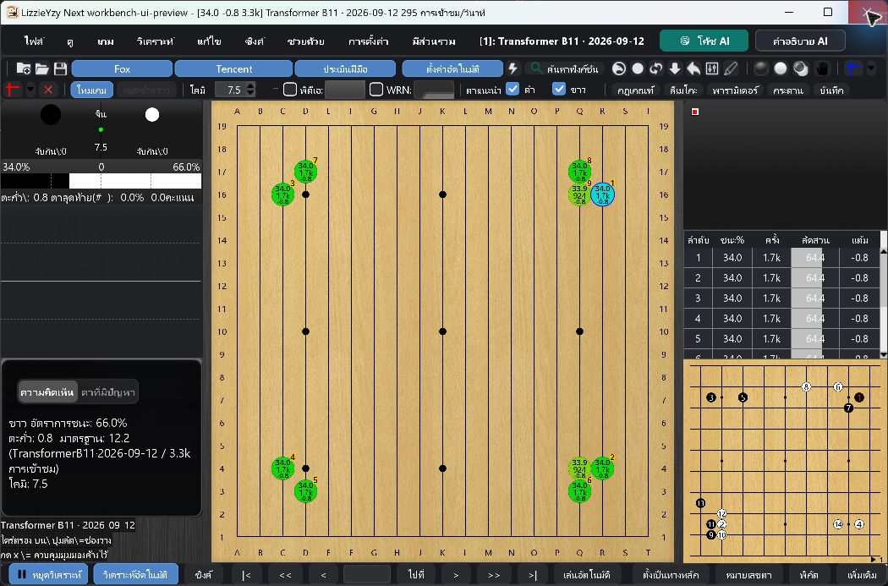
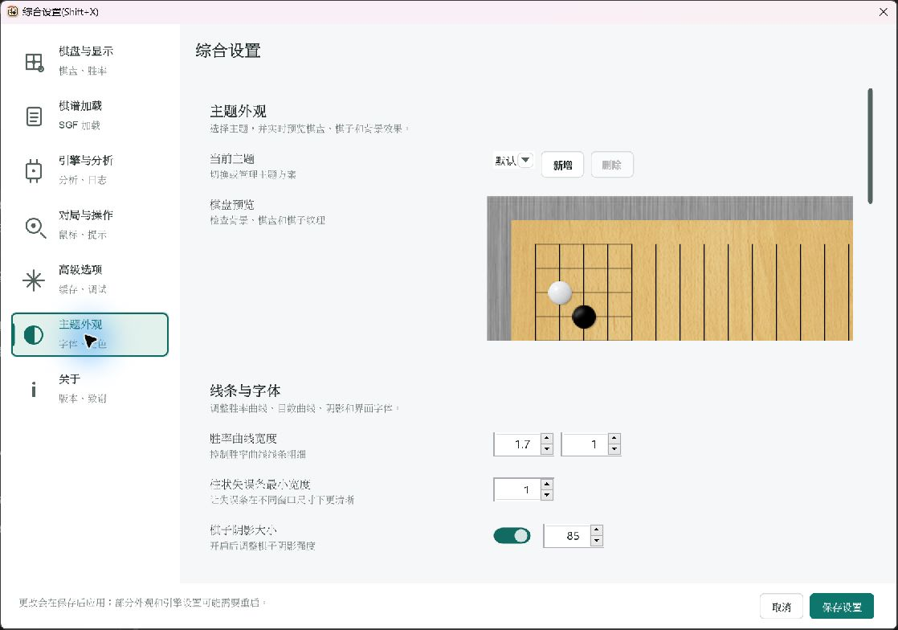
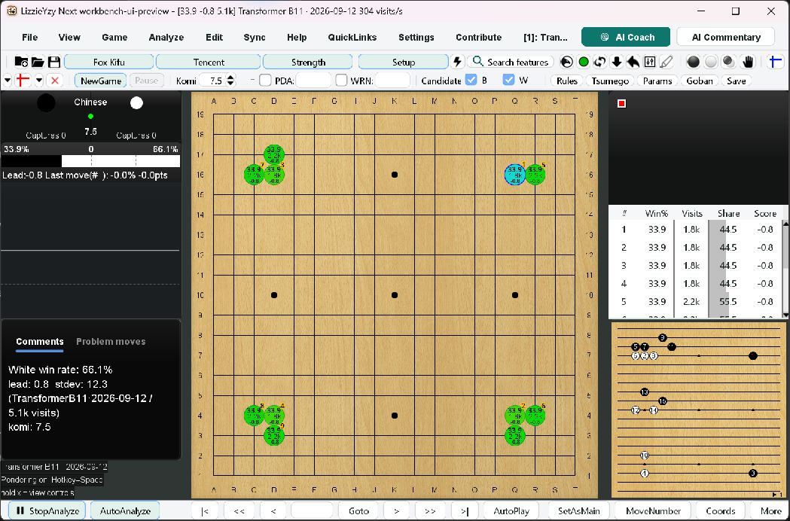
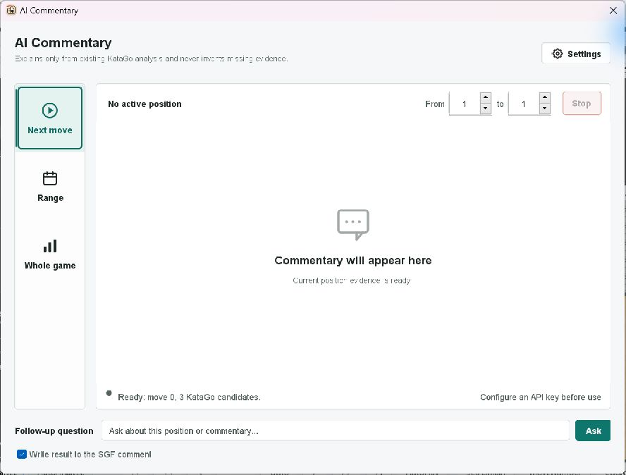
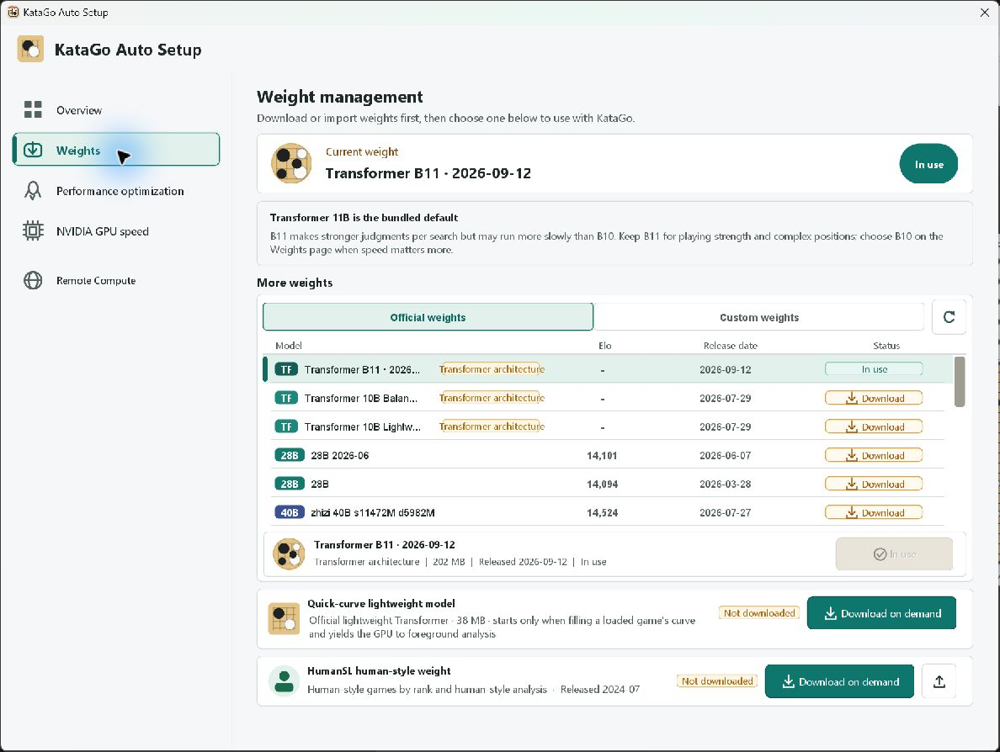
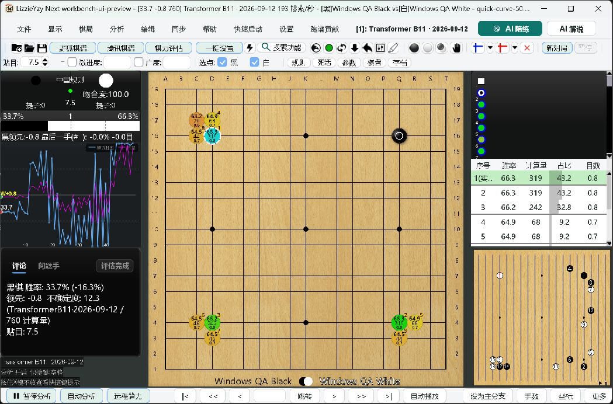

# Swing Workbench UI Acceptance - 2026-09-26

## Conclusion And Scope

**PASS for the recorded Windows UI and automated scenarios below.** Deferred
keyboard and NVDA checks were completed independently; no user-assisted keyboard
gate remains. This is not an exhaustive all-languages/all-dialogs/all-DPI cross
product or a cross-platform release certification.

UI PR #551 is stacked on refresh-icon PR #550, targeting
`fix/remote-model-refresh-icon`. Neither was merged and no release was created.
Retarget and recheck after #550 is merged.

- Last checked main: `50898233f5cce7d952b37cdb9ee005f780ea948f`.
- Dependency/base: `ee774cac8df2150c5349492059f83a99327d9ab2`.
- Windows 11 Pro 23H2, build 22631.6199; NVIDIA RTX 3070.
- Build JDK 21.0.2; portable runtime Eclipse Adoptium 21.0.12.1+1-LTS.
- Real EXE: `target/ui-qa/portable/LizzieYzy Next NVIDIA.exe`.
- Final built and EXE JAR SHA-256:
  `aa924941eec11708e6c351364ebb9ce5e71c89a5a0483e929bdceef764462c25`.
- Only isolated portable configuration and caches were used. The original dirty
  checkout and real user configuration, weights and caches were not changed.

## Implemented Scope

Shared light/dark surfaces, semantic text colors, teal actions, user fonts and
visible focus extend AppleStyleSupport. Wooden board, explicit themes, wallpaper,
curve colors, layout and existing commands remain available. General settings
use compact navigation, adjacent form labels, wrapping content and a fixed footer.
Remote compute keeps its flows, refresh icon and model-name tooltips. Setup
prioritizes readiness/model status, folds technical paths and retains a single
catalog with separate download/apply/import actions. Training and commentary
share styling without changes to engine protocols, account storage, networking,
model strategy or analysis lifecycle.

## Problems Fixed And Retested

| Problem | Root cause and fix | Verification |
| --- | --- | --- |
| Settings focus/clicks lost | Unowned modal; give it the main-window owner | Production regression and EXE keyboard/mouse |
| Settings rows outside viewport | Fixed sizing and nested FlowLayout assumptions | Responsive viewport/row regressions and real navigation |
| Theme opens at bottom | Deferred reconstruction and read-only label caret scrolling | Independent navigation token, suppress label-only caret scrolling; production test and EXE |
| Board preview collapsed | Empty painted FlowLayout measured as 10px, not declared 180px | Respect explicit height; regression failed before fix |
| Dark combos/bottom bar unreadable | Native painter and toolbar branch retained light surfaces | Shared theme painting, contrast tests, actual 200% Thai/dark |
| Status/description styles inconsistent | Light-only colors and generic style overrides | Semantic colors and component tests |
| Setup sections not announced | JPanel list renderer lacked standard Java Access Bridge label semantics | JLabel renderer; NVDA arrow navigation speaks each name and position |
| Training mode unnamed | Visual-only form label | labelFor association and actual NVDA |
| Commentary range fields unnamed | Spinner model replacement recreated editors | Copy parent accessibility metadata; actual NVDA |
| English Whole game clipped | Fixed mode-button/rail width | Font-measured uniform width; six-language regression and EXE |
| AI button disappeared in narrow window | Long engine caption wrapped Windows proxy commands below visible strip | Abbreviate only engine captions, keep tooltip/name; width regression and EXE |
| Download on demand clipped | Final border wider than cached preferred size | Measure text/icon/insets after styling; six-language regression and EXE |

Temporary tracing was removed. Unrelated Menu.java formatter changes were
removed; its additional change only identifies the two engine menus.

## Final Automated Results

| Command/lane | Exact result |
| --- | --- |
| `mvn -B -Djava.awt.headless=true -Dfmt.skip=true verify` | BUILD SUCCESS, 4m59s; 4,408 unit tests, 0 failures, 0 errors, 92 skipped |
| Integration tests in verify | 7 tests, 0 failures, 0 errors, 6 skipped; LoggingProviderSmokeIT executed against shaded JAR |
| Non-headless desktop package lane | BUILD SUCCESS, 1m14s; 103 tests, 0 failures, 0 errors, 0 skipped |
| `python scripts/test_windows_launcher_packaging.py` | Passed |
| `python scripts/check_line_endings.py` | Passed |
| `python scripts/check_markdown_links.py` | Local links passed |
| `git diff --check` | Passed |
| LauncherOnly + OpenAutoSetup + PreserveConfig | Passed with bundled JVM; no Failed to launch JVM |

Desktop command:

```text
mvn -B -Djava.awt.headless=false -Dfmt.skip=true -Dtest=ConfigDialog2NavigationTest,WorkbenchStyleTest,AccessibilitySupportTest,RemoteComputeDialogLayoutTest,RemoteComputeRefreshButtonTest,KataGoAutoSetupDialogLayoutTest,MenuAiFeatureButtonLayoutTest,TeacherDialogViewTest,WindowMenuStripTest package
```

Launcher command:

```powershell
powershell -ExecutionPolicy Bypass -File scripts/windows_smoke_test.ps1 -AppExe "<isolated portable>\LizzieYzy Next NVIDIA.exe" -ConfigDir "<isolated portable>\user-data" -LauncherOnly -OpenAutoSetup -PreserveConfig
```

Logs: `target/ui-accepted-verify.log`,
`target/ui-accepted-desktop-package.log`, `target/ui-accepted-launcher.log`.
Maven calls ran sequentially; packaging is included. Skipped cases are not
counted as executed. Tested normal/secondary/status text pairs meet 4.5:1 in
both themes; that is not a claim about every application pixel.

An early full run hit the existing 3-second CrashPersistenceBarrierTest handoff
latch. Its isolated rerun and later complete runs passed. No unrelated logging
fix was made. Interrupted builds were discarded, not counted as passes.

## Real Windows Scenarios

| Scenario | Actual result |
| --- | --- |
| Launch/relaunch | Bundled Java and local CUDA/B11 produce positive visits; no system Java dependency |
| Ordinary SGF open | Double-clicked quick-curve-50.sgf in ordinary file picker; automatic curve completed, not a placeholder line |
| Suggested moves | Two consecutive pointer selections placed stones and resumed analysis; small-board PV retained |
| Main commands | Lightning, shape judgement, small board, training and commentary retained |
| Settings | Sidebar clicks, wrapped forms, full preview, fixed footer, keyboard and save succeeded |
| Save/restart | Show quick actions persisted across locale restarts; final save returned to live analysis |
| Setup | Readiness, technical details, weights, performance, NVIDIA and vertical scrolling inspected |
| Remote | Logged-out/self-hosted UI, URL label, model ellipsis/tooltip and refresh inspected; no credentials submitted |
| Training | Modes, More, labels and close inspected; no HumanSL download/game started in this UI pass |
| Commentary | Mode rail, range fields, empty state, input and close inspected; no paid API request |
| Exit | Previews closed normally; launcher cleanup completed |

One earlier preview closed unexpectedly during overlapping desktop-test/UI work.
No crash exception or hs_err file was found; cause is unestablished. Final runs
separated visible desktop tests from manual EXE operation. Save, restart and
repeated dialog entry did not reproduce it. Retain this as a diagnostic risk.

The native file picker can lose focus when the helper activates the main HWND.
Final loading used the visible SGF row's double-click, not a scripted loading hook.

## Languages And Scaling

Original Windows: 150%, 2560 x 1600. Actual scaling was changed with the EXE closed,
then restarted with no JVM scale override; restored to **150%** afterward.

| Actual scale | Locale/theme | Real windows checked |
| --- | --- | --- |
| 100% | Simplified Chinese/light | Main/B11, settings, remote, training/More, commentary |
| 150% | Simplified Chinese/light | Main, settings, setup pages, remote, training, commentary, keyboard/NVDA, final SGF/curve/moves |
| 150% | English/light | Main normal/max, settings/save, all setup pages, remote, training/More, commentary; final long-label fixes |
| 150% | Japanese/light | Main, all setup pages, remote, training/More, commentary |
| 150% | Korean/light | Main, settings/theme preview, setup overview/weights, remote, training/More, commentary |
| 150% | Traditional Chinese/light | Main, setup overview/weights, remote, training/More, commentary |
| 200% | Thai/dark | Main/B11, settings, all setup pages/scrolling, remote, training, commentary; toolbar retest |

Earlier JVM-only samples: Chinese 1.5; Traditional Chinese 2.0 main/settings/theme;
Japanese 1.0 main/settings/training; Korean 1.5 main/settings; Thai 2.0 dark.
Those are not physical scaling results. Final label fixes also have six-language
text-width/row-boundary regressions. This is a risk-based matrix, not all
combinations. Captures resample thin glyph/grid strokes; they are not a native
glyph-quality certification. Translation naturalness was not exhaustively audited.

## Independent Keyboard And NVDA

Official NVDA 2026.2 portable was SHA-256 checked and Authenticode verified.
It ran isolated with add-ons disabled, without system installation/startup/global
Java accessibility changes, and was stopped afterward. Evidence is actual NVDA
speech-engine output after native EXE focus events, not just component metadata.
Voice pronunciation/audio-device quality was not rated. Raw logs are private.

| Flow | Native result |
| --- | --- |
| Main | F6/Shift+F6 across board/sidebar/toolbars/menu; board, last-move, remote and commentary announced by purpose |
| Remote | Enter opens; Tab to self-hosted, Space selects, Tab to named URL/ws-wss guidance; Esc closes |
| Training | Enter expands More, Tab to mode, Shift+Tab returns, Space collapses, Esc closes; mode/value announced |
| Commentary | Space opens, Tab/Shift+Tab through range; from/to names and values announced after editor replacement; Esc closes |
| Setup | Tab/Shift+Tab through sections/actions, Down switches pages; NVDA speaks weights 2 of 4, performance 3 of 4, NVIDIA 4 of 4; Esc closes |
| Settings | Pointer, Tab/Shift+Tab, Enter/Space sidebar and Esc work after ownership fix |

Focus is visible. Selected/disabled/engine status use text/control state as well
as color. Not every icon or asynchronous announcement was spoken in every language.

## Reviewed Screenshots

Unedited captures; settings before/after differ in size/scale and compare
structure, not identical pixels.

















## Evidence And Limits

- Worktree: `C:\Users\kk\.codex\worktrees\unified-workbench-ui\lizzieyzynext`.
- Screenshots: `C:\ailearn3\lizzieyzynext\.qa\ui-workbench-20260926\screenshots`.
- Final curve/moves: `80-final-sgf-curve.png`, `81-final-recommended-moves.png`.
- Theme: `52-theme-top-and-preview-final.png`, `74-settings-ko-theme.png`.
- NVDA-visible setup: `55-setup-nvidia-nvda-final.png`.
- Locale continuation: screenshots 57 through 79.
- Scale restore: `45-system-scale-restored-150.png`.
- NVDA logs remain private in the isolated QA directory.

macOS/Linux hardware, logged-in remote sessions, paid AI responses, HumanSL
training games and unlisted language/DPI combinations were not verified in this
UI-only pass. GitHub checks must be reviewed on the pushed PR head. Do not publish
user-data, caches, engine binaries, raw reader logs or account information.
