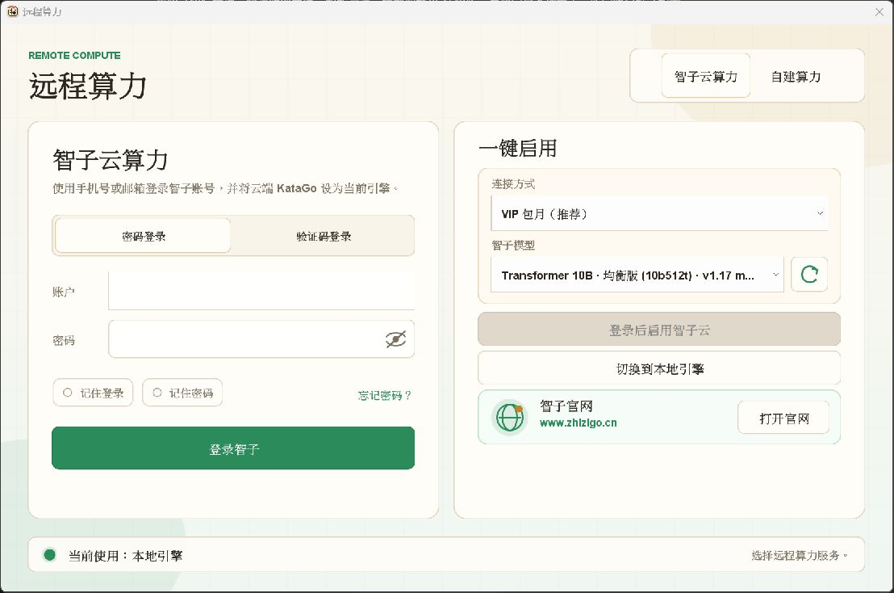
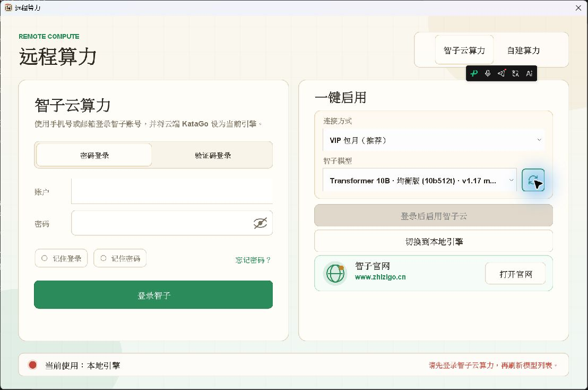

# Remote Model Refresh Button

Windows 11 Pro, build 22631. Tested on 2026-09-26 with an isolated
`LizzieYzy Next NVIDIA.exe`, the release's bundled Java runtime, the candidate
shaded JAR, and a new signed-out configuration. No real credentials, paid cloud
sessions, engine models, or installed user configuration were changed.

## Visual Change

The hand-drawn near-circle is replaced with Lucide's two-arrow `refresh-cw`
icon, adapted to Java2D without a new runtime dependency. The click target is
44 x 44 logical pixels, matching the model selector's row height. Hover,
pressed, disabled, refreshing, and keyboard-focus states remain distinct.
The existing model-fetch action, localized tooltip and accessible name are
unchanged. The Lucide ISC notice is included in the application JAR.

Before, native scale:

After, 150% Java drawing scale, with the refresh button focused:

Additional actual EXE captures:

- [100% Java drawing scale](after-100.png)
- [200% Java drawing scale](after-200.png)

These are separate launches with `sun.java2d.uiScale=1`, `1.5`, and `2`;
Windows display settings were not changed. The floating black input-method
toolbar visible in some captures is external to Lizzie. All three launches
showed the new icon without clipping or overlap with the model selector.

## Validation

- Targeted headless tests: 47 tests, 0 failures, 0 errors, 0 skipped.
- Full `mvn -B -Djava.awt.headless=true -Dfmt.skip=true verify`: 4,389 unit
  tests (92 conditional skips) and 7 integration tests (6 conditional skips),
  0 failures/errors. Packaging and `LoggingProviderSmokeIT` passed.
- Native Windows, non-headless button/layout tests: 18 tests, 0 failures,
  0 errors, 0 skipped.
- Launcher packaging guards, line-ending check, Markdown links and
  `git diff --check` passed.
- Actual UI: mouse activation displayed the existing sign-in-required status;
  Shift+Tab/Tab moved focus away from/back to the refresh button; Space was
  exercised on the focused button; Escape closed the dialog. All test
  application launches were exited normally.

Pixel regression tests cover the two-arrow icon at 1x/1.5x/2x, stable button
dimensions, hover/pressed/disabled/loading styling, detached animation timer
cleanup, accessible naming and the standard Swing button action bindings.
Loading/disabled states were exercised in component tests, not through a
live authenticated cloud request. This focused UI change does not claim
new cloud inference, macOS, or Linux desktop acceptance.
